# NinjaTrader 8 Group Trade AddOn 架构设计文档

> **版本**: 1.0
> **日期**: 2026-02-03
> **作者**: AI Assistant
> **状态**: 设计阶段

---

## 目录

1. [概述](#1-概述)
2. [系统架构](#2-系统架构)
3. [核心组件设计](#3-核心组件设计)
4. [数据模型](#4-数据模型)
5. [核心流程](#5-核心流程)
6. [UI 设计](#6-ui-设计)
7. [API 参考](#7-api-参考)
8. [实现细节](#8-实现细节)
9. [测试策略](#9-测试策略)
10. [附录](#10-附录)

---

## 1. 概述

### 1.1 背景

NinjaTrader 7 曾提供 Account Groups 功能，允许在一个「组账户」上下单后自动复制到多个账户。但在 NinjaTrader 8 中，该功能被官方移除。本项目旨在通过 NinjaScript AddOn 重新实现多账户联动下单功能。

### 1.2 目标

开发一个 **Group Trade AddOn** 插件，对标业界领先的 Replikanto，实现：

**核心功能**
- 监听主账户订单变化
- 自动复制订单到配置的从账户
- 支持多种手数比例模式（7种）
- 同步订单生命周期（开仓、改单、平仓）
- 提供友好的 WPF 配置界面

**高级功能（参考 Replikanto）**
- **Cross Order（跨合约复制）**: 支持 Mini ↔ Micro 合约互转（ES ↔ MES, NQ ↔ MNQ 等）
- **Market Only 模式**: 仅复制市价单成交，忽略限价/止损挂单
- **Follower Guard（从账户保护）**: 异常情况自动平仓并解除跟随
- **Stealth Mode（隐身模式）**: 隐藏订单中的复制标记，避免被识别
- **ATM Copy**: 使用主账户的 ATM 策略规则管理从账户出场订单
- **Network/Remote Mode**: 支持跨机器、跨网络复制（本地局域网 / 互联网）
- **配置导入/导出**: 支持从账户列表和配置的批量管理

### 1.3 技术栈

| 技术 | 版本/说明 |
|------|----------|
| .NET Framework | 4.8 |
| C# | 8.0+ |
| WPF/XAML | UI 框架 |
| NinjaTrader SDK | NT8 Desktop SDK |

### 1.4 术语定义

| 术语 | 定义 |
|------|------|
| 主账户 (Leader Account) | 被监听的信号源账户，用户在此账户下单 |
| 从账户 (Follower Account) | 接收复制订单的目标账户 |
| Trade Copier | 订单复制器，本插件的核心功能 |
| 订单映射 | 主账户订单与从账户复制订单的对应关系 |
| Cross Order | 跨合约复制，如 ES → MES 的自动转换 |
| OCO | One-Cancels-Other，关联订单组 |
| ATM Strategy | NinjaTrader 的自动交易管理策略 |

### 1.5 竞品对比 (vs Replikanto)

| 功能 | Replikanto | Group Trade (本项目) |
|------|------------|---------------------|
| 本地多账户复制 | ✅ | ✅ Phase 1 |
| 7种比例模式 | ✅ | ✅ Phase 1 |
| Cross Order (跨合约) | ✅ | ✅ Phase 2 |
| OCO 订单同步 | ✅ | ✅ Phase 1 |
| Network Mode (局域网) | ✅ | 🔄 Phase 3 |
| Remote Mode (互联网) | ✅ (付费) | 🔄 Phase 3 |
| ATM Copy | ✅ | 🔄 Phase 2 |
| Follower Guard | ✅ | ✅ Phase 2 |
| Stealth Mode | ✅ | ✅ Phase 1 |
| Market Only | ✅ | ✅ Phase 1 |
| 配置导入/导出 | ✅ | ✅ Phase 1 |
| NT7 兼容 | ✅ | ❌ |
| TradingView 集成 | ✅ | 🔄 Phase 3 |

---

## 2. 系统架构

### 2.1 整体架构图（增强版）

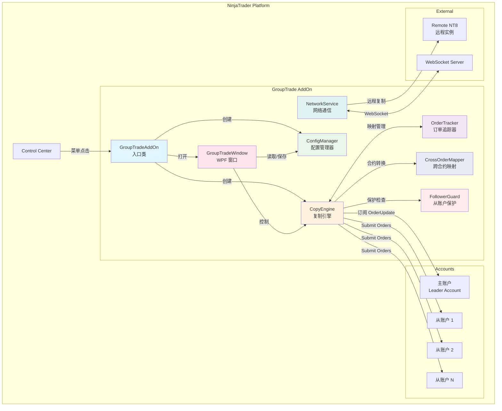
```mermaid
graph TB
    subgraph NinjaTrader Platform
        CC[Control Center]

        subgraph GroupTrade AddOn
            ADDON[GroupTradeAddOn<br/>入口类]
            ENGINE[CopyEngine<br/>复制引擎]
            TRACKER[OrderTracker<br/>订单追踪器]
            CONFIG[ConfigManager<br/>配置管理器]
            WINDOW[GroupTradeWindow<br/>WPF 窗口]
            CROSS[CrossOrderMapper<br/>跨合约映射]
            GUARD[FollowerGuard<br/>从账户保护]
            NETWORK[NetworkService<br/>网络通信]
        end

        subgraph Accounts
            LEADER[主账户<br/>Leader Account]
            F1[从账户 1]
            F2[从账户 2]
            F3[从账户 N]
        end

        subgraph External
            REMOTE[Remote NT8<br/>远程实例]
            WS[WebSocket Server]
        end
    end

    CC -->|菜单点击| ADDON
    ADDON -->|创建| ENGINE
    ADDON -->|创建| CONFIG
    ADDON -->|打开| WINDOW

    ENGINE -->|订阅 OrderUpdate| LEADER
    ENGINE -->|Submit Orders| F1
    ENGINE -->|Submit Orders| F2
    ENGINE -->|Submit Orders| F3
    ENGINE <-->|映射管理| TRACKER
    ENGINE -->|合约转换| CROSS
    ENGINE -->|保护检查| GUARD

    NETWORK <-->|WebSocket| WS
    NETWORK -->|远程复制| REMOTE

    WINDOW -->|读取/保存| CONFIG
    WINDOW -->|控制| ENGINE

    style ADDON fill:#e1f5fe
    style ENGINE fill:#fff3e0
    style TRACKER fill:#f3e5f5
    style CONFIG fill:#e8f5e9
    style WINDOW fill:#fce4ec
    style CROSS fill:#e8eaf6
    style GUARD fill:#ffebee
    style NETWORK fill:#e0f2f1
```

### 2.2 分层架构

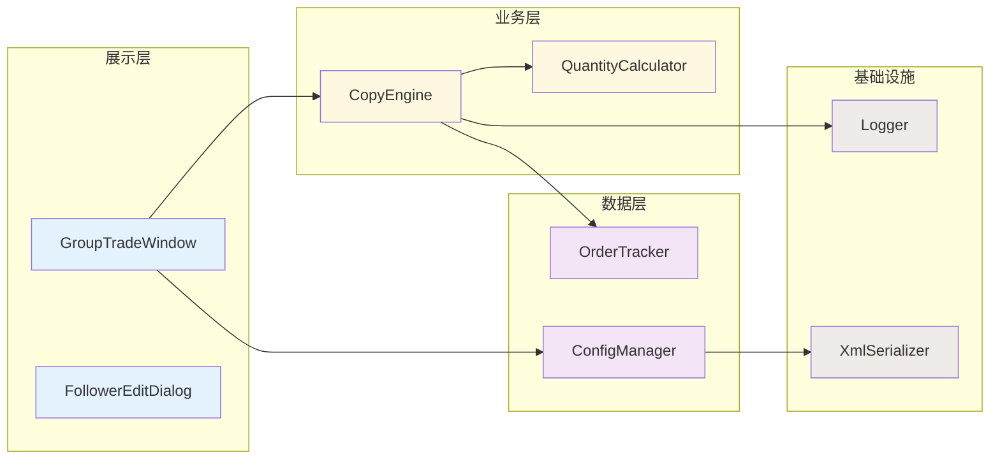
```mermaid
graph LR
    subgraph 展示层
        UI[GroupTradeWindow]
        DIALOG[FollowerEditDialog]
    end

    subgraph 业务层
        ENGINE[CopyEngine]
        CALC[QuantityCalculator]
    end

    subgraph 数据层
        TRACKER[OrderTracker]
        CONFIG[ConfigManager]
    end

    subgraph 基础设施
        LOGGER[Logger]
        SERIALIZER[XmlSerializer]
    end

    UI --> ENGINE
    UI --> CONFIG
    ENGINE --> TRACKER
    ENGINE --> CALC
    CONFIG --> SERIALIZER
    ENGINE --> LOGGER

    style UI fill:#e3f2fd
    style DIALOG fill:#e3f2fd
    style ENGINE fill:#fff8e1
    style CALC fill:#fff8e1
    style TRACKER fill:#f3e5f5
    style CONFIG fill:#f3e5f5
    style LOGGER fill:#efebe9
    style SERIALIZER fill:#efebe9
```

### 2.3 文件结构

```
AddOns/
├── GroupTradeAddOn.cs                    # 入口类
└── GroupTrade/
    ├── Core/
    │   ├── CopyEngine.cs                 # 核心复制引擎
    │   ├── OrderTracker.cs               # 订单映射追踪
    │   ├── QuantityCalculator.cs         # 手数计算器 (7种模式)
    │   ├── CrossOrderMapper.cs           # 跨合约映射器
    │   └── FollowerGuard.cs              # 从账户保护服务
    ├── Models/
    │   ├── RatioMode.cs                  # 比例模式枚举 (7种)
    │   ├── CopyMode.cs                   # 复制模式枚举
    │   ├── FollowerAccountConfig.cs      # 从账户配置
    │   ├── CopyConfiguration.cs          # 完整配置
    │   ├── OrderMapping.cs               # 订单映射
    │   ├── CrossOrderPair.cs             # 跨合约对
    │   ├── GuardRule.cs                  # 保护规则
    │   └── CopyStatus.cs                 # 运行状态
    ├── Network/
    │   ├── NetworkService.cs             # 网络通信服务
    │   ├── WebSocketClient.cs            # WebSocket 客户端
    │   ├── WebSocketServer.cs            # WebSocket 服务端
    │   ├── NetworkNode.cs                # 网络节点模型
    │   └── MessageProtocol.cs            # 消息协议定义
    ├── Services/
    │   ├── ConfigManager.cs              # 配置持久化
    │   ├── ImportExportService.cs        # 导入导出服务
    │   ├── EmailNotifier.cs              # 邮件通知服务
    │   └── Logger.cs                     # 日志服务
    └── UI/
        ├── GroupTradeWindow.xaml         # 主窗口
        ├── GroupTradeWindow.xaml.cs
        ├── FollowerEditDialog.xaml       # 从账户编辑
        ├── NetworkNodeDialog.xaml        # 网络节点配置
        ├── CrossOrderDialog.xaml         # 跨合约配置
        └── GuardRuleDialog.xaml          # 保护规则配置
```

---

## 2.4 Cross Order (跨合约复制) 设计

### 2.4.1 支持的合约对照表

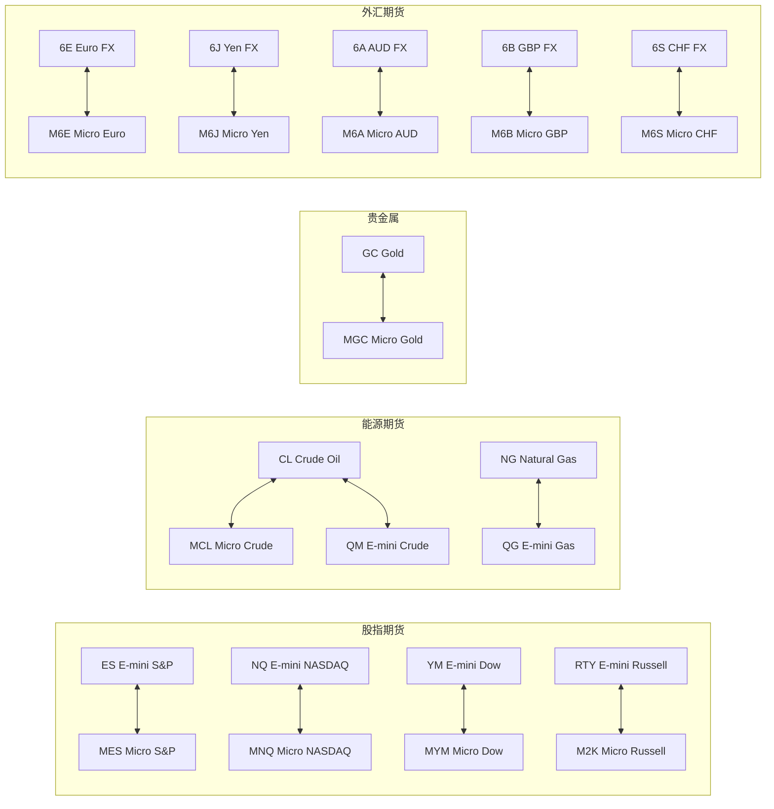
```mermaid
graph LR
    subgraph 股指期货
        ES[ES E-mini S&P] <--> MES[MES Micro S&P]
        NQ[NQ E-mini NASDAQ] <--> MNQ[MNQ Micro NASDAQ]
        YM[YM E-mini Dow] <--> MYM[MYM Micro Dow]
        RTY[RTY E-mini Russell] <--> M2K[M2K Micro Russell]
    end

    subgraph 能源期货
        CL[CL Crude Oil] <--> MCL[MCL Micro Crude]
        CL <--> QM[QM E-mini Crude]
        NG[NG Natural Gas] <--> QG[QG E-mini Gas]
    end

    subgraph 贵金属
        GC[GC Gold] <--> MGC[MGC Micro Gold]
    end

    subgraph 外汇期货
        E6[6E Euro FX] <--> M6E[M6E Micro Euro]
        J6[6J Yen FX] <--> M6J[M6J Micro Yen]
        A6[6A AUD FX] <--> M6A[M6A Micro AUD]
        B6[6B GBP FX] <--> M6B[M6B Micro GBP]
        S6[6S CHF FX] <--> M6S[M6S Micro CHF]
    end
```

### 2.4.2 合约转换配置

| Mini Symbol | Micro Symbol | 转换比例 | 点值比例 |
|-------------|--------------|---------|---------|
| ES | MES | 10:1 | $50 : $5 |
| NQ | MNQ | 10:1 | $20 : $2 |
| YM | MYM | 10:1 | $5 : $0.50 |
| RTY | M2K | 10:1 | $50 : $5 |
| CL | MCL | 10:1 | $1000 : $100 |
| CL | QM | 2:1 | $1000 : $500 |
| GC | MGC | 10:1 | $100 : $10 |
| 6E | M6E | 8:1 | $125,000 : $12,500 |

### 2.4.3 CrossOrderMapper 类设计

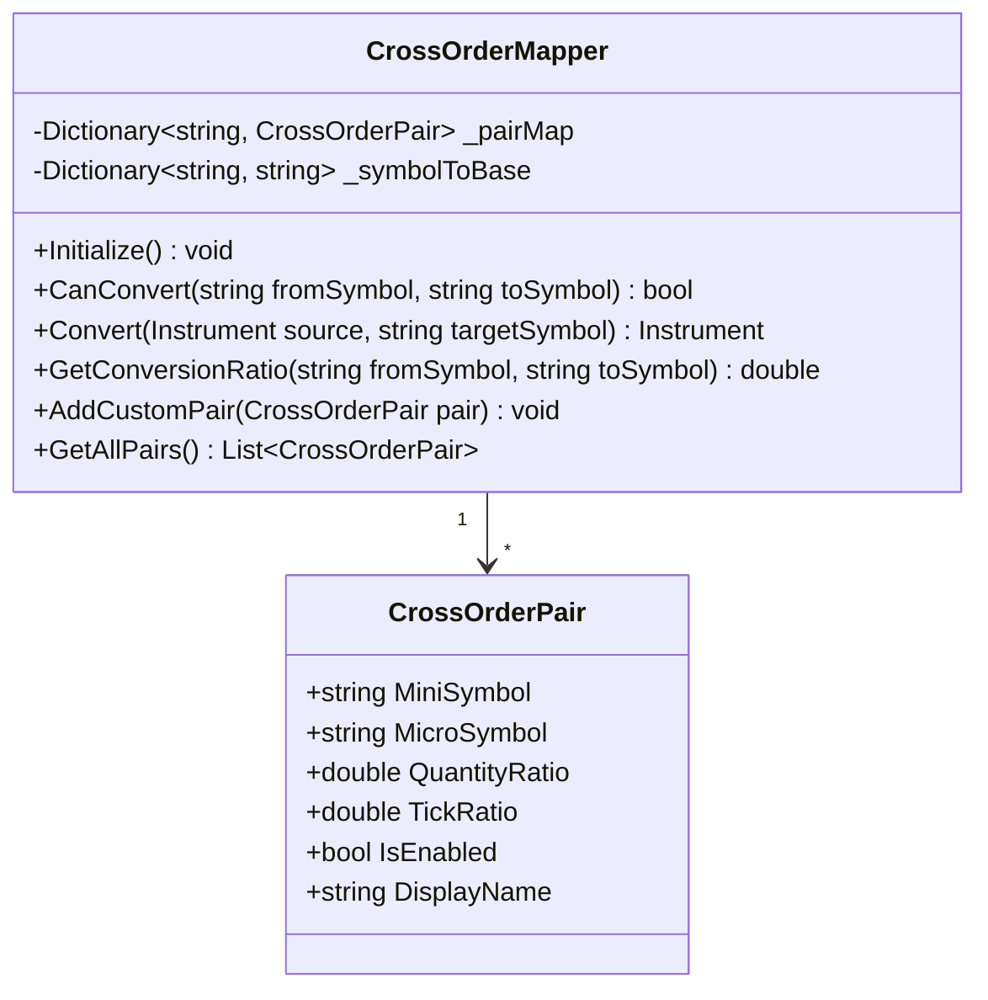
```mermaid
classDiagram
    class CrossOrderMapper {
        -Dictionary~string, CrossOrderPair~ _pairMap
        -Dictionary~string, string~ _symbolToBase

        +Initialize() void
        +CanConvert(string fromSymbol, string toSymbol) bool
        +Convert(Instrument source, string targetSymbol) Instrument
        +GetConversionRatio(string fromSymbol, string toSymbol) double
        +AddCustomPair(CrossOrderPair pair) void
        +GetAllPairs() List~CrossOrderPair~
    }

    class CrossOrderPair {
        +string MiniSymbol
        +string MicroSymbol
        +double QuantityRatio
        +double TickRatio
        +bool IsEnabled
        +string DisplayName
    }

    CrossOrderMapper "1" --> "*" CrossOrderPair
```

---

## 2.5 Follower Guard (从账户保护) 设计

### 2.5.1 保护触发条件

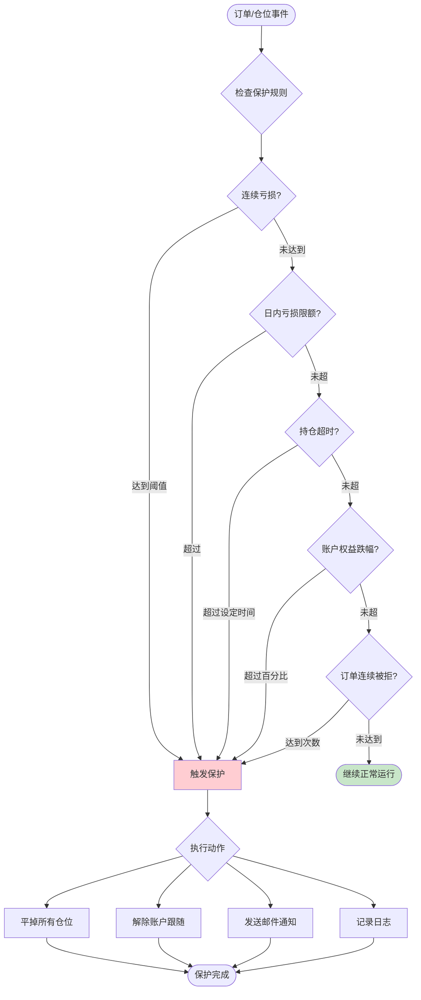
```mermaid
flowchart TD
    START([订单/仓位事件]) --> CHECK{检查保护规则}

    CHECK --> R1{连续亏损?}
    R1 -->|达到阈值| TRIGGER
    R1 -->|未达到| R2

    R2{日内亏损限额?}
    R2 -->|超过| TRIGGER
    R2 -->|未超| R3

    R3{持仓超时?}
    R3 -->|超过设定时间| TRIGGER
    R3 -->|未超| R4

    R4{账户权益跌幅?}
    R4 -->|超过百分比| TRIGGER
    R4 -->|未超| R5

    R5{订单连续被拒?}
    R5 -->|达到次数| TRIGGER
    R5 -->|未达到| PASS

    TRIGGER[触发保护] --> ACTION{执行动作}
    ACTION --> A1[平掉所有仓位]
    ACTION --> A2[解除账户跟随]
    ACTION --> A3[发送邮件通知]
    ACTION --> A4[记录日志]

    PASS([继续正常运行])

    A1 --> END([保护完成])
    A2 --> END
    A3 --> END
    A4 --> END

    style TRIGGER fill:#ffcdd2
    style PASS fill:#c8e6c9
```

### 2.5.2 保护规则配置

```csharp
public class GuardRule
{
    // 规则类型
    public GuardRuleType Type { get; set; }

    // 阈值设置
    public int ConsecutiveLossCount { get; set; } = 3;      // 连续亏损次数
    public double DailyLossLimit { get; set; } = 500.0;     // 日亏损限额 ($)
    public double EquityDrawdownPercent { get; set; } = 5;  // 权益跌幅 (%)
    public int PositionTimeoutMinutes { get; set; } = 60;   // 持仓超时 (分钟)
    public int RejectedOrderCount { get; set; } = 5;        // 订单被拒次数

    // 触发动作
    public bool FlattenPosition { get; set; } = true;       // 平仓
    public bool DisableFollower { get; set; } = true;       // 解除跟随
    public bool SendEmailAlert { get; set; } = true;        // 发送邮件

    // 是否启用
    public bool IsEnabled { get; set; } = true;
}

public enum GuardRuleType
{
    ConsecutiveLoss,      // 连续亏损
    DailyLossLimit,       // 日亏损限额
    EquityDrawdown,       // 权益跌幅
    PositionTimeout,      // 持仓超时
    OrderRejected         // 订单被拒
}
```

---

## 2.6 Network/Remote Mode 通信架构

### 2.6.1 网络模式对比

| 模式 | 适用场景 | 通信方式 | 延迟 | 复杂度 |
|------|---------|---------|------|--------|
| **Local Mode** | 同一台机器多账户 | 内存直接调用 | <1ms | 低 |
| **Network Mode** | 局域网内多机器 | TCP Socket | 1-10ms | 中 |
| **Remote Mode** | 跨互联网多地点 | WebSocket (WSS) | 10-100ms | 高 |

### 2.6.2 Network Mode 架构

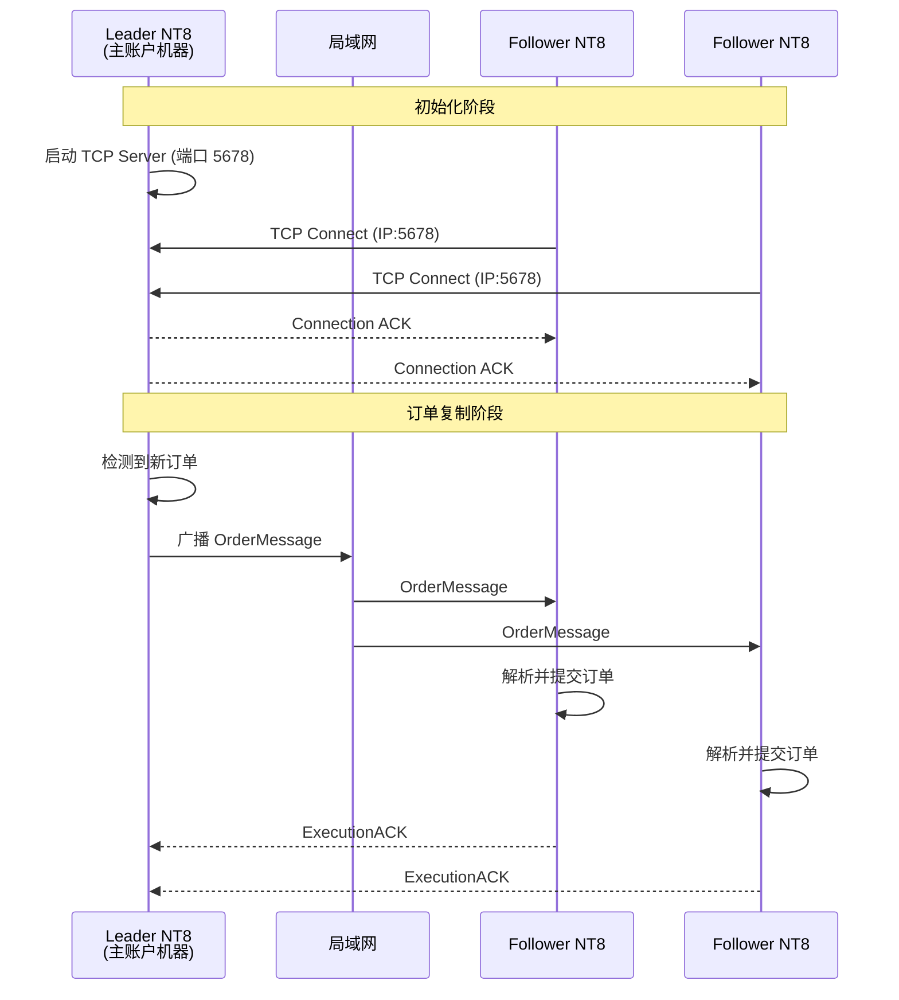
```mermaid
sequenceDiagram
    participant Leader as Leader NT8<br/>(主账户机器)
    participant LAN as 局域网
    participant F1 as Follower NT8 #1
    participant F2 as Follower NT8 #2

    Note over Leader,F2: 初始化阶段
    Leader->>Leader: 启动 TCP Server (端口 5678)
    F1->>Leader: TCP Connect (IP:5678)
    F2->>Leader: TCP Connect (IP:5678)
    Leader-->>F1: Connection ACK
    Leader-->>F2: Connection ACK

    Note over Leader,F2: 订单复制阶段
    Leader->>Leader: 检测到新订单
    Leader->>LAN: 广播 OrderMessage
    LAN->>F1: OrderMessage
    LAN->>F2: OrderMessage
    F1->>F1: 解析并提交订单
    F2->>F2: 解析并提交订单
    F1-->>Leader: ExecutionACK
    F2-->>Leader: ExecutionACK
```

### 2.6.3 Remote Mode 架构 (互联网)

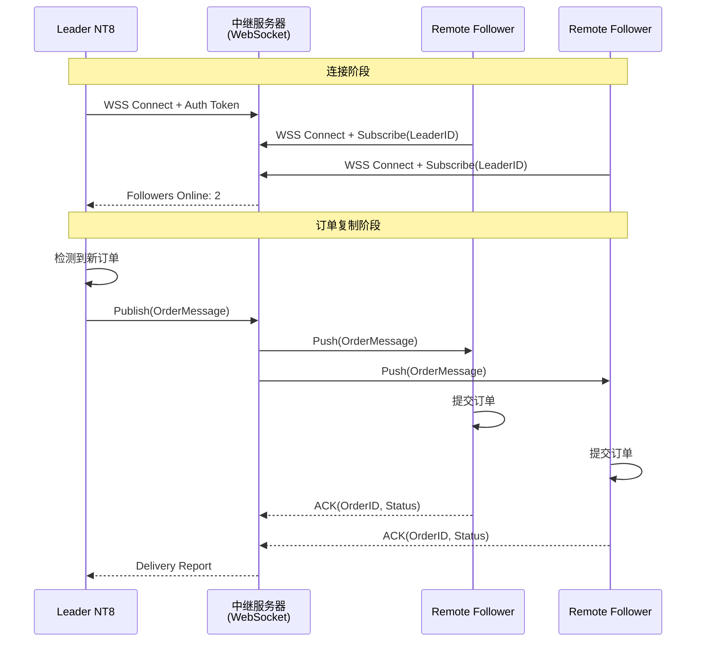
```mermaid
sequenceDiagram
    participant Leader as Leader NT8
    participant Cloud as 中继服务器<br/>(WebSocket)
    participant F1 as Remote Follower #1
    participant F2 as Remote Follower #2

    Note over Leader,F2: 连接阶段
    Leader->>Cloud: WSS Connect + Auth Token
    F1->>Cloud: WSS Connect + Subscribe(LeaderID)
    F2->>Cloud: WSS Connect + Subscribe(LeaderID)
    Cloud-->>Leader: Followers Online: 2

    Note over Leader,F2: 订单复制阶段
    Leader->>Leader: 检测到新订单
    Leader->>Cloud: Publish(OrderMessage)
    Cloud->>F1: Push(OrderMessage)
    Cloud->>F2: Push(OrderMessage)
    F1->>F1: 提交订单
    F2->>F2: 提交订单
    F1-->>Cloud: ACK(OrderID, Status)
    F2-->>Cloud: ACK(OrderID, Status)
    Cloud-->>Leader: Delivery Report
```

### 2.6.4 消息协议设计

```json
// OrderMessage - 订单复制消息
{
    "type": "ORDER",
    "version": "1.0",
    "timestamp": "2026-02-03T14:32:15.123Z",
    "leaderAccountId": "Sim101",
    "messageId": "msg_abc123",
    "payload": {
        "action": "NEW",  // NEW, MODIFY, CANCEL
        "orderId": "order_xyz789",
        "instrument": "NQ 03-26",
        "orderAction": "Buy",
        "orderType": "Market",
        "quantity": 2,
        "limitPrice": 0,
        "stopPrice": 0,
        "ocoId": "",
        "crossOrderTarget": "MNQ"  // 可选: 跨合约目标
    }
}

// ExecutionACK - 执行确认
{
    "type": "ACK",
    "messageId": "msg_abc123",
    "followerAccountId": "Sim102",
    "status": "EXECUTED",  // EXECUTED, REJECTED, PARTIAL
    "followerOrderId": "order_local456",
    "executedQty": 1,
    "error": null
}
```

---

## 2.7 七种比例模式详解

### 2.7.1 模式对比表

| 模式 | 公式 | 适用场景 | 示例 |
|------|------|---------|------|
| **Exact Quantity** | follower_qty = leader_qty | 所有账户同手数 | Leader 4手 → 每个Follower 4手 |
| **Equal Quantity** | follower_qty = leader_qty / n | 平均分配到N个账户 | 40手分4账户 → 每个10手 |
| **Ratio** | follower_qty = leader_qty × ratio | 按固定比例 | 2手 × 0.5 = 1手 |
| **Net Liquidation** | follower_qty = leader_qty × (f_nlv / l_nlv) | 按净清算值比例 | 按$100k:$50k = 2:1 |
| **Available Money** | follower_qty = leader_qty × (f_avail / l_avail) | 按可用资金比例 | 按可用余额比例 |
| **Percentage Change** | 增/减现有仓位百分比 | 仓位调整 | +50% 当前仓位 |
| **Pre Allocation** | follower_qty = 预设固定值 | 固定手数交易 | 始终使用预设的2手 |

### 2.7.2 计算流程图

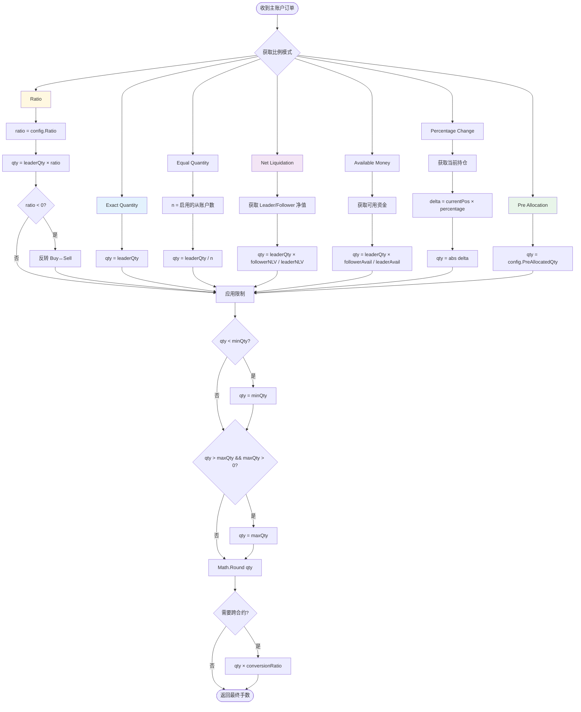
```mermaid
flowchart TD
    START([收到主账户订单]) --> GET_MODE{获取比例模式}

    GET_MODE --> EXACT[Exact Quantity]
    GET_MODE --> EQUAL[Equal Quantity]
    GET_MODE --> RATIO[Ratio]
    GET_MODE --> NLV[Net Liquidation]
    GET_MODE --> AVAIL[Available Money]
    GET_MODE --> PCT[Percentage Change]
    GET_MODE --> PRE[Pre Allocation]

    EXACT --> E1[qty = leaderQty]

    EQUAL --> E2[n = 启用的从账户数]
    E2 --> E2B[qty = leaderQty / n]

    RATIO --> E3[ratio = config.Ratio]
    E3 --> E3B[qty = leaderQty × ratio]
    E3B --> E3C{ratio < 0?}
    E3C -->|是| E3D[反转 Buy↔Sell]
    E3C -->|否| APPLY
    E3D --> APPLY

    NLV --> E4[获取 Leader/Follower 净值]
    E4 --> E4B[qty = leaderQty × followerNLV / leaderNLV]

    AVAIL --> E5[获取可用资金]
    E5 --> E5B[qty = leaderQty × followerAvail / leaderAvail]

    PCT --> E6[获取当前持仓]
    E6 --> E6B[delta = currentPos × percentage]
    E6B --> E6C[qty = abs delta]

    PRE --> E7[qty = config.PreAllocatedQty]

    E1 --> APPLY
    E2B --> APPLY
    E4B --> APPLY
    E5B --> APPLY
    E6C --> APPLY
    E7 --> APPLY

    APPLY[应用限制] --> MIN{qty < minQty?}
    MIN -->|是| SET_MIN[qty = minQty]
    MIN -->|否| MAX{qty > maxQty && maxQty > 0?}
    SET_MIN --> MAX
    MAX -->|是| SET_MAX[qty = maxQty]
    MAX -->|否| ROUND
    SET_MAX --> ROUND

    ROUND[Math.Round qty] --> CROSS{需要跨合约?}
    CROSS -->|是| CONVERT[qty × conversionRatio]
    CROSS -->|否| END
    CONVERT --> END([返回最终手数])

    style EXACT fill:#e3f2fd
    style RATIO fill:#fff8e1
    style NLV fill:#f3e5f5
    style PRE fill:#e8f5e9
```

---

## 3. 核心组件设计

### 3.1 GroupTradeAddOn (入口类)

**职责**: 插件生命周期管理、菜单注册、资源协调

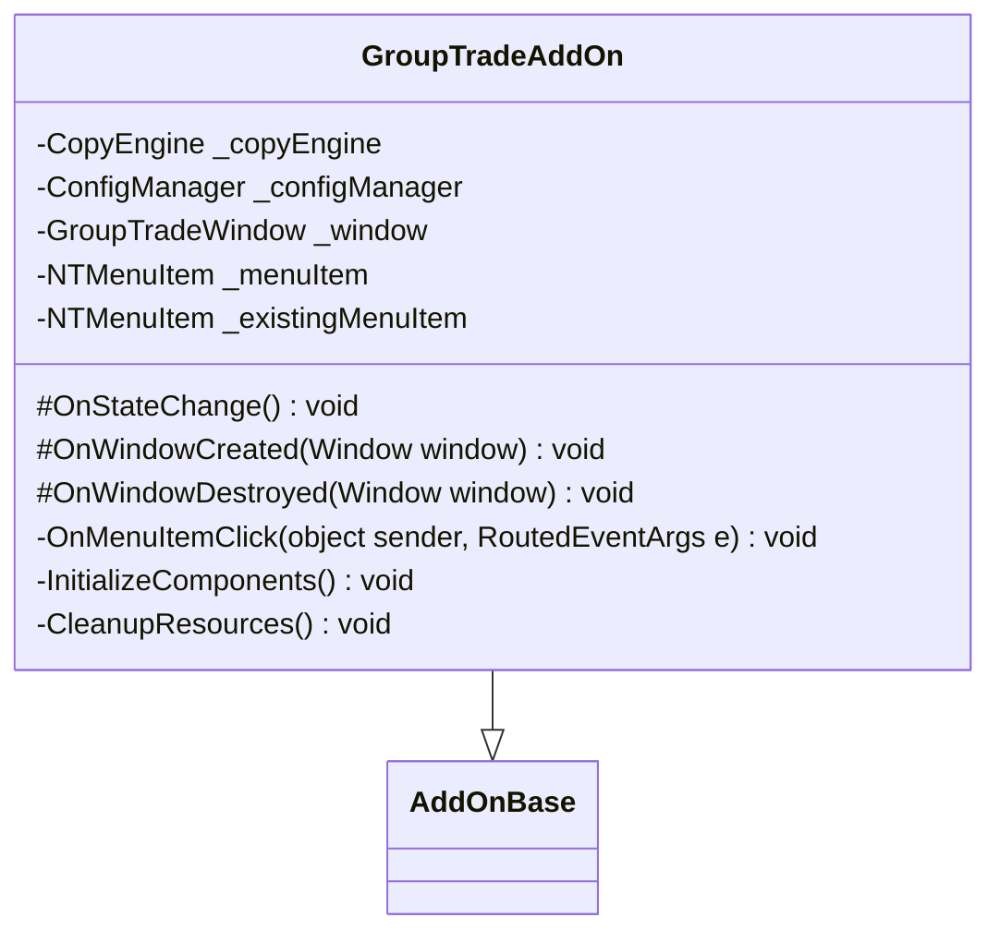
```mermaid
classDiagram
    class GroupTradeAddOn {
        -CopyEngine _copyEngine
        -ConfigManager _configManager
        -GroupTradeWindow _window
        -NTMenuItem _menuItem
        -NTMenuItem _existingMenuItem

        #OnStateChange() void
        #OnWindowCreated(Window window) void
        #OnWindowDestroyed(Window window) void
        -OnMenuItemClick(object sender, RoutedEventArgs e) void
        -InitializeComponents() void
        -CleanupResources() void
    }

    GroupTradeAddOn --|> AddOnBase
```

**状态机**:

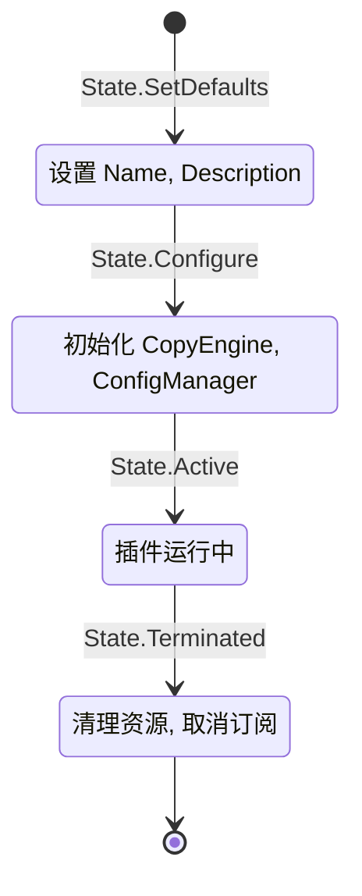
```mermaid
stateDiagram-v2
    [*] --> SetDefaults: State.SetDefaults
    SetDefaults --> Configure: State.Configure
    Configure --> Active: State.Active
    Active --> Terminated: State.Terminated
    Terminated --> [*]

    SetDefaults: 设置 Name, Description
    Configure: 初始化 CopyEngine, ConfigManager
    Active: 插件运行中
    Terminated: 清理资源, 取消订阅
```

### 3.2 CopyEngine (复制引擎)

**职责**: 订单监听、复制逻辑、生命周期同步

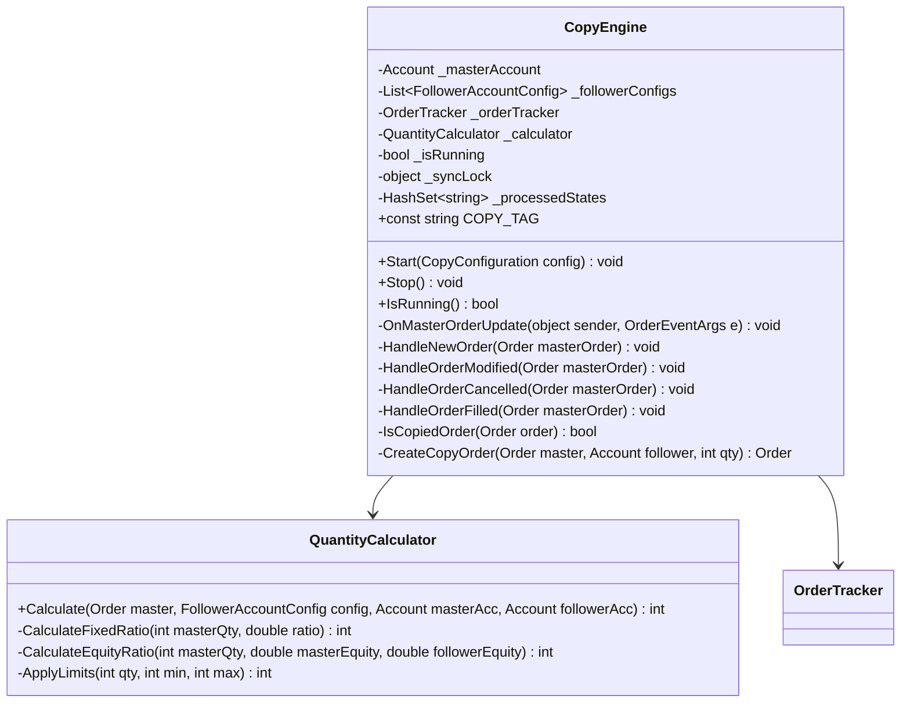
```mermaid
classDiagram
    class CopyEngine {
        -Account _masterAccount
        -List~FollowerAccountConfig~ _followerConfigs
        -OrderTracker _orderTracker
        -QuantityCalculator _calculator
        -bool _isRunning
        -object _syncLock
        -HashSet~string~ _processedStates
        +const string COPY_TAG

        +Start(CopyConfiguration config) void
        +Stop() void
        +IsRunning() bool
        -OnMasterOrderUpdate(object sender, OrderEventArgs e) void
        -HandleNewOrder(Order masterOrder) void
        -HandleOrderModified(Order masterOrder) void
        -HandleOrderCancelled(Order masterOrder) void
        -HandleOrderFilled(Order masterOrder) void
        -IsCopiedOrder(Order order) bool
        -CreateCopyOrder(Order master, Account follower, int qty) Order
    }

    class QuantityCalculator {
        +Calculate(Order master, FollowerAccountConfig config, Account masterAcc, Account followerAcc) int
        -CalculateFixedRatio(int masterQty, double ratio) int
        -CalculateEquityRatio(int masterQty, double masterEquity, double followerEquity) int
        -ApplyLimits(int qty, int min, int max) int
    }

    CopyEngine --> QuantityCalculator
    CopyEngine --> OrderTracker
```

### 3.3 OrderTracker (订单追踪器)

**职责**: 维护主从订单映射关系、状态追踪、查询接口

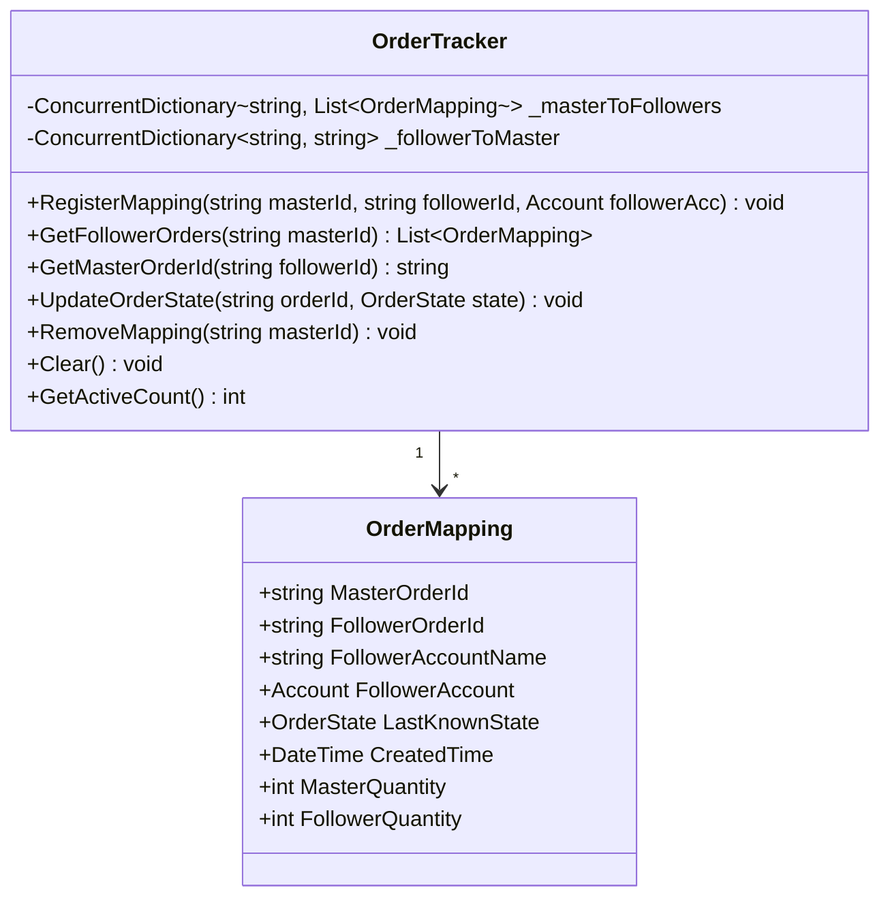
```mermaid
classDiagram
    class OrderTracker {
        -ConcurrentDictionary~string, List~OrderMapping~~ _masterToFollowers
        -ConcurrentDictionary~string, string~ _followerToMaster

        +RegisterMapping(string masterId, string followerId, Account followerAcc) void
        +GetFollowerOrders(string masterId) List~OrderMapping~
        +GetMasterOrderId(string followerId) string
        +UpdateOrderState(string orderId, OrderState state) void
        +RemoveMapping(string masterId) void
        +Clear() void
        +GetActiveCount() int
    }

    class OrderMapping {
        +string MasterOrderId
        +string FollowerOrderId
        +string FollowerAccountName
        +Account FollowerAccount
        +OrderState LastKnownState
        +DateTime CreatedTime
        +int MasterQuantity
        +int FollowerQuantity
    }

    OrderTracker "1" --> "*" OrderMapping
```

### 3.4 ConfigManager (配置管理器)

**职责**: 配置持久化（XML格式）

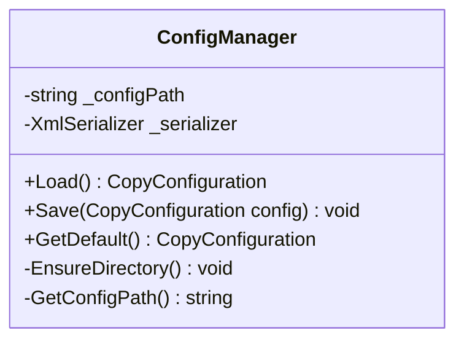
```mermaid
classDiagram
    class ConfigManager {
        -string _configPath
        -XmlSerializer _serializer

        +Load() CopyConfiguration
        +Save(CopyConfiguration config) void
        +GetDefault() CopyConfiguration
        -EnsureDirectory() void
        -GetConfigPath() string
    }
```

---

## 4. 数据模型

### 4.1 类图

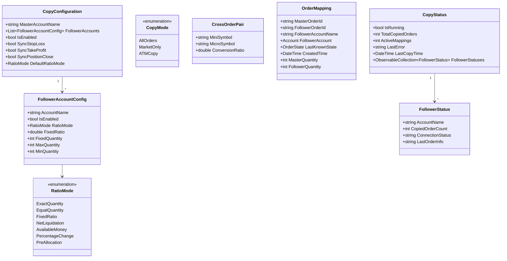
```mermaid
classDiagram
    class CopyConfiguration {
        +string MasterAccountName
        +List~FollowerAccountConfig~ FollowerAccounts
        +bool IsEnabled
        +bool SyncStopLoss
        +bool SyncTakeProfit
        +bool SyncPositionClose
        +RatioMode DefaultRatioMode
    }

    class FollowerAccountConfig {
        +string AccountName
        +bool IsEnabled
        +RatioMode RatioMode
        +double FixedRatio
        +int FixedQuantity
        +int MaxQuantity
        +int MinQuantity
    }

    class RatioMode {
        <<enumeration>>
        ExactQuantity
        EqualQuantity
        FixedRatio
        NetLiquidation
        AvailableMoney
        PercentageChange
        PreAllocation
    }

    class CopyMode {
        <<enumeration>>
        AllOrders
        MarketOnly
        ATMCopy
    }

    class CrossOrderPair {
        +string MiniSymbol
        +string MicroSymbol
        +double ConversionRatio
    }

    class OrderMapping {
        +string MasterOrderId
        +string FollowerOrderId
        +string FollowerAccountName
        +Account FollowerAccount
        +OrderState LastKnownState
        +DateTime CreatedTime
        +int MasterQuantity
        +int FollowerQuantity
    }

    class CopyStatus {
        +bool IsRunning
        +int TotalCopiedOrders
        +int ActiveMappings
        +string LastError
        +DateTime LastCopyTime
        +ObservableCollection~FollowerStatus~ FollowerStatuses
    }

    class FollowerStatus {
        +string AccountName
        +int CopiedOrderCount
        +string ConnectionStatus
        +string LastOrderInfo
    }

    CopyConfiguration "1" --> "*" FollowerAccountConfig
    FollowerAccountConfig --> RatioMode
    CopyStatus "1" --> "*" FollowerStatus
```

### 4.2 配置 XML 示例

```xml
<?xml version="1.0" encoding="utf-8"?>
<CopyConfiguration>
  <MasterAccountName>Sim101</MasterAccountName>
  <IsEnabled>true</IsEnabled>
  <SyncStopLoss>true</SyncStopLoss>
  <SyncTakeProfit>true</SyncTakeProfit>
  <SyncPositionClose>true</SyncPositionClose>
  <DefaultRatioMode>FixedRatio</DefaultRatioMode>
  <FollowerAccounts>
    <FollowerAccountConfig>
      <AccountName>Sim102</AccountName>
      <IsEnabled>true</IsEnabled>
      <RatioMode>FixedRatio</RatioMode>
      <FixedRatio>0.5</FixedRatio>
      <FixedQuantity>0</FixedQuantity>
      <MaxQuantity>10</MaxQuantity>
      <MinQuantity>1</MinQuantity>
    </FollowerAccountConfig>
    <FollowerAccountConfig>
      <AccountName>Sim103</AccountName>
      <IsEnabled>true</IsEnabled>
      <RatioMode>EquityRatio</RatioMode>
      <FixedRatio>0</FixedRatio>
      <FixedQuantity>0</FixedQuantity>
      <MaxQuantity>5</MaxQuantity>
      <MinQuantity>1</MinQuantity>
    </FollowerAccountConfig>
  </FollowerAccounts>
</CopyConfiguration>
```

---

## 5. 核心流程

### 5.1 插件启动流程

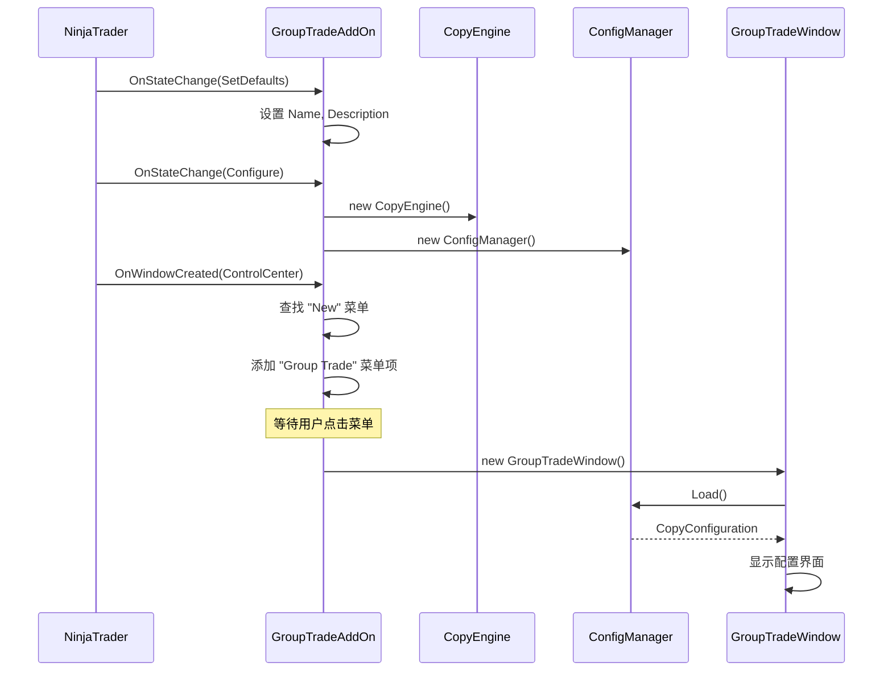
```mermaid
sequenceDiagram
    participant NT as NinjaTrader
    participant ADDON as GroupTradeAddOn
    participant ENGINE as CopyEngine
    participant CONFIG as ConfigManager
    participant WINDOW as GroupTradeWindow

    NT->>ADDON: OnStateChange(SetDefaults)
    ADDON->>ADDON: 设置 Name, Description

    NT->>ADDON: OnStateChange(Configure)
    ADDON->>ENGINE: new CopyEngine()
    ADDON->>CONFIG: new ConfigManager()

    NT->>ADDON: OnWindowCreated(ControlCenter)
    ADDON->>ADDON: 查找 "New" 菜单
    ADDON->>ADDON: 添加 "Group Trade" 菜单项

    Note over ADDON: 等待用户点击菜单

    ADDON->>WINDOW: new GroupTradeWindow()
    WINDOW->>CONFIG: Load()
    CONFIG-->>WINDOW: CopyConfiguration
    WINDOW->>WINDOW: 显示配置界面
```

### 5.2 订单复制核心流程

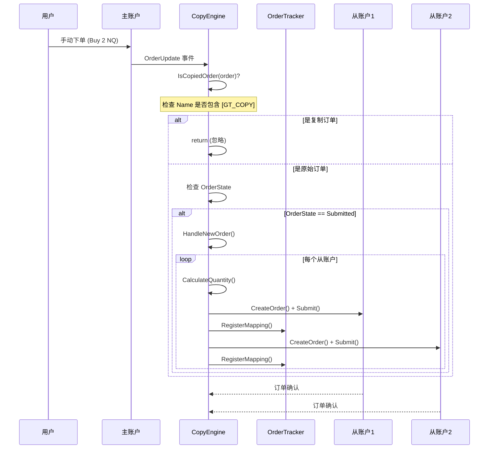
```mermaid
sequenceDiagram
    participant USER as 用户
    participant MASTER as 主账户
    participant ENGINE as CopyEngine
    participant TRACKER as OrderTracker
    participant F1 as 从账户1
    participant F2 as 从账户2

    USER->>MASTER: 手动下单 (Buy 2 NQ)
    MASTER->>ENGINE: OrderUpdate 事件

    ENGINE->>ENGINE: IsCopiedOrder(order)?
    Note over ENGINE: 检查 Name 是否包含 [GT_COPY]

    alt 是复制订单
        ENGINE->>ENGINE: return (忽略)
    else 是原始订单
        ENGINE->>ENGINE: 检查 OrderState

        alt OrderState == Submitted
            ENGINE->>ENGINE: HandleNewOrder()

            loop 每个从账户
                ENGINE->>ENGINE: CalculateQuantity()
                ENGINE->>F1: CreateOrder() + Submit()
                ENGINE->>TRACKER: RegisterMapping()
                ENGINE->>F2: CreateOrder() + Submit()
                ENGINE->>TRACKER: RegisterMapping()
            end
        end
    end

    F1-->>ENGINE: 订单确认
    F2-->>ENGINE: 订单确认
```

### 5.3 订单状态同步流程

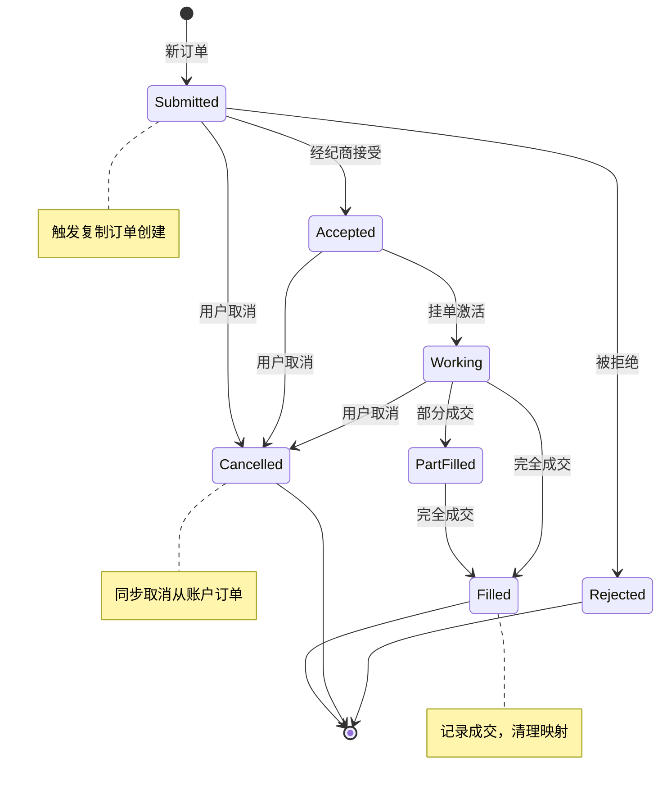
```mermaid
stateDiagram-v2
    [*] --> Submitted: 新订单
    Submitted --> Accepted: 经纪商接受
    Accepted --> Working: 挂单激活
    Working --> PartFilled: 部分成交
    PartFilled --> Filled: 完全成交
    Working --> Filled: 完全成交

    Submitted --> Cancelled: 用户取消
    Accepted --> Cancelled: 用户取消
    Working --> Cancelled: 用户取消

    Submitted --> Rejected: 被拒绝

    Filled --> [*]
    Cancelled --> [*]
    Rejected --> [*]

    note right of Submitted
        触发复制订单创建
    end note

    note right of Cancelled
        同步取消从账户订单
    end note

    note right of Filled
        记录成交，清理映射
    end note
```

### 5.4 手数计算流程

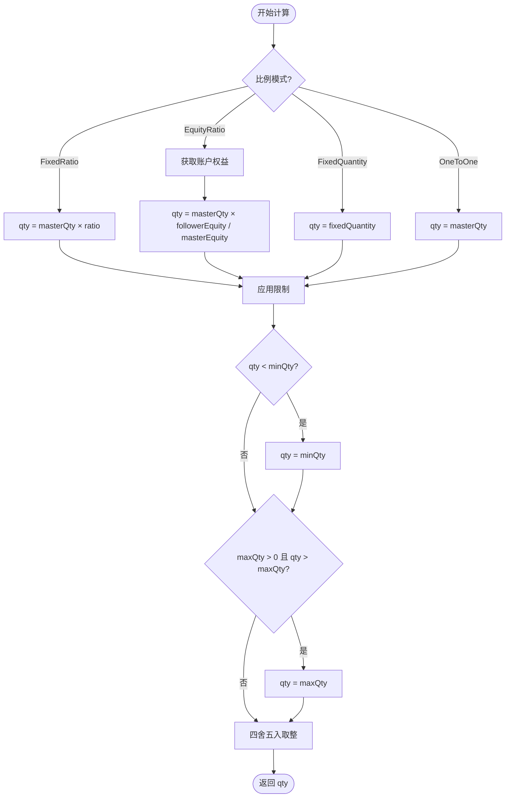
```mermaid
flowchart TD
    START([开始计算]) --> MODE{比例模式?}

    MODE -->|FixedRatio| FR[qty = masterQty × ratio]
    MODE -->|EquityRatio| ER[获取账户权益]
    MODE -->|FixedQuantity| FQ[qty = fixedQuantity]
    MODE -->|OneToOne| OO[qty = masterQty]

    ER --> ER_CALC[qty = masterQty × followerEquity / masterEquity]

    FR --> LIMIT
    ER_CALC --> LIMIT
    FQ --> LIMIT
    OO --> LIMIT

    LIMIT[应用限制] --> MIN{qty < minQty?}
    MIN -->|是| SET_MIN[qty = minQty]
    MIN -->|否| MAX{maxQty > 0 且 qty > maxQty?}

    SET_MIN --> MAX
    MAX -->|是| SET_MAX[qty = maxQty]
    MAX -->|否| ROUND

    SET_MAX --> ROUND[四舍五入取整]
    ROUND --> END([返回 qty])
```

### 5.5 防循环复制机制

```mermaid
flowchart TD
    ORDER[收到订单事件] --> CHECK{检查 Order.Name}

    CHECK -->|包含 '[GT_COPY]'| IGNORE[忽略此订单]
    CHECK -->|不包含| PROCESS[处理订单]

    PROCESS --> CREATE[创建复制订单]
    CREATE --> TAG[设置 Name = '[GT_COPY]' + masterId]
    TAG --> SUBMIT[提交到从账户]

    IGNORE --> END([结束])
    SUBMIT --> END

    style IGNORE fill:#ffcdd2
    style PROCESS fill:#c8e6c9
    style TAG fill:#fff9c4
```

---

## 6. UI 设计

### 6.1 主窗口布局

```
┌──────────────────────────────────────────────────────────────────┐
│  Group Trade - 多账户联动下单                              [_][□][X] │
├──────────────────────────────────────────────────────────────────┤
│                                                                  │
│  ┌─ 主账户设置 ────────────────────────────────────────────────┐ │
│  │                                                              │ │
│  │  主账户: [Sim101              ▼]    [刷新账户]              │ │
│  │                                                              │ │
│  │  账户权益: $50,000.00          可用保证金: $45,000.00       │ │
│  │                                                              │ │
│  └──────────────────────────────────────────────────────────────┘ │
│                                                                  │
│  ┌─ 从账户配置 ────────────────────────────────────────────────┐ │
│  │                                                              │ │
│  │  ┌────────────────────────────────────────────────────────┐ │ │
│  │  │ ☑ │ 账户名      │ 模式     │ 比例/手数 │ 最大 │ 状态  │ │ │
│  │  ├────────────────────────────────────────────────────────┤ │ │
│  │  │ ☑ │ Sim102      │ 固定比例 │ 0.5       │ 10   │ 就绪  │ │ │
│  │  │ ☑ │ Sim103      │ 资金比例 │ -         │ 5    │ 就绪  │ │ │
│  │  │ ☐ │ Live-APEX   │ 固定手数 │ 2         │ 2    │ 禁用  │ │ │
│  │  └────────────────────────────────────────────────────────┘ │ │
│  │                                                              │ │
│  │  [添加账户]  [编辑]  [删除]                                  │ │
│  │                                                              │ │
│  └──────────────────────────────────────────────────────────────┘ │
│                                                                  │
│  ┌─ 同步选项 ──────────────────────────────────────────────────┐ │
│  │                                                              │ │
│  │  ☑ 同步止损单    ☑ 同步止盈单    ☑ 同步平仓操作            │ │
│  │                                                              │ │
│  └──────────────────────────────────────────────────────────────┘ │
│                                                                  │
│  ┌─ 运行状态 ──────────────────────────────────────────────────┐ │
│  │                                                              │ │
│  │  状态: ● 运行中                      已复制订单: 15         │ │
│  │  活跃映射: 3                         最后复制: 14:32:15     │ │
│  │                                                              │ │
│  │  ┌──────────────────────────────────────────────────────┐   │ │
│  │  │ [14:32:15] Sim101 Buy 2 NQ → Sim102 Buy 1            │   │ │
│  │  │ [14:32:15] Sim101 Buy 2 NQ → Sim103 Buy 1            │   │ │
│  │  │ [14:30:22] Sim101 Sell 1 ES → Sim102 Sell 1          │   │ │
│  │  └──────────────────────────────────────────────────────┘   │ │
│  │                                                              │ │
│  └──────────────────────────────────────────────────────────────┘ │
│                                                                  │
│  ┌──────────────────────────────────────────────────────────────┐ │
│  │      [▶ 启动复制]      [■ 停止复制]      [保存配置]         │ │
│  └──────────────────────────────────────────────────────────────┘ │
│                                                                  │
└──────────────────────────────────────────────────────────────────┘
```

### 6.2 UI 组件层次

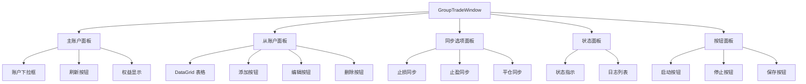
```mermaid
graph TD
    WINDOW[GroupTradeWindow] --> MASTER_PANEL[主账户面板]
    WINDOW --> FOLLOWER_PANEL[从账户面板]
    WINDOW --> SYNC_PANEL[同步选项面板]
    WINDOW --> STATUS_PANEL[状态面板]
    WINDOW --> BUTTON_PANEL[按钮面板]

    MASTER_PANEL --> ACC_COMBO[账户下拉框]
    MASTER_PANEL --> REFRESH_BTN[刷新按钮]
    MASTER_PANEL --> EQUITY_LABEL[权益显示]

    FOLLOWER_PANEL --> GRID[DataGrid 表格]
    FOLLOWER_PANEL --> ADD_BTN[添加按钮]
    FOLLOWER_PANEL --> EDIT_BTN[编辑按钮]
    FOLLOWER_PANEL --> DEL_BTN[删除按钮]

    SYNC_PANEL --> SL_CHECK[止损同步]
    SYNC_PANEL --> TP_CHECK[止盈同步]
    SYNC_PANEL --> CLOSE_CHECK[平仓同步]

    STATUS_PANEL --> STATUS_LABEL[状态指示]
    STATUS_PANEL --> LOG_LIST[日志列表]

    BUTTON_PANEL --> START_BTN[启动按钮]
    BUTTON_PANEL --> STOP_BTN[停止按钮]
    BUTTON_PANEL --> SAVE_BTN[保存按钮]
```

---

## 7. API 参考

### 7.1 NinjaTrader SDK 关键 API

#### Account 类

```csharp
// 获取所有账户
lock (Account.All)
{
    var accounts = Account.All.ToList();
}

// 获取账户权益
double equity = account.Get(AccountItem.CashValue, Currency.UsDollar);

// 订阅订单更新
account.OrderUpdate += OnOrderUpdate;

// 取消订阅
account.OrderUpdate -= OnOrderUpdate;

// 创建订单
Order order = account.CreateOrder(
    instrument,           // Instrument
    OrderAction.Buy,      // OrderAction
    OrderType.Market,     // OrderType
    OrderEntry.Manual,    // OrderEntry
    TimeInForce.Day,      // TimeInForce
    quantity,             // int
    limitPrice,           // double
    stopPrice,            // double
    ocoId,                // string
    orderName,            // string
    Core.Globals.MaxDate, // DateTime
    null                  // CustomOrder
);

// 提交订单
account.Submit(new[] { order });

// 取消订单
account.Cancel(new[] { order });

// 修改订单
account.Change(new[] { order });
```

#### Order 类

```csharp
// 主要属性
order.OrderId        // 订单 ID (可能变化)
order.Account        // 所属账户
order.Instrument     // 合约
order.OrderAction    // Buy/Sell/BuyToCover/SellShort
order.OrderType      // Market/Limit/StopMarket/StopLimit
order.OrderState     // 状态
order.Quantity       // 数量
order.Filled         // 已成交数量
order.LimitPrice     // 限价
order.StopPrice      // 止损价
order.Name           // 订单名称
order.Oco            // OCO ID

// 检查是否终态
bool isTerminal = Order.IsTerminalState(order.OrderState);
```

#### OrderState 枚举

```csharp
OrderState.Initialized     // 初始化
OrderState.Submitted       // 已提交
OrderState.Accepted        // 已接受
OrderState.TriggerPending  // 待触发
OrderState.Working         // 挂单中
OrderState.ChangeSubmitted // 改单已提交
OrderState.ChangePending   // 改单待处理
OrderState.CancelSubmitted // 取消已提交
OrderState.CancelPending   // 取消待处理
OrderState.Cancelled       // 已取消
OrderState.Rejected        // 被拒绝
OrderState.PartFilled      // 部分成交
OrderState.Filled          // 完全成交
```

#### OrderEventArgs

```csharp
void OnOrderUpdate(object sender, OrderEventArgs e)
{
    Order order = e.Order;
    OrderState state = e.OrderState;
    int quantity = e.Quantity;
    double avgFillPrice = e.AverageFillPrice;
}
```

### 7.2 AddOnBase 类

```csharp
public class MyAddOn : AddOnBase
{
    protected override void OnStateChange()
    {
        if (State == State.SetDefaults)
        {
            Name = "My AddOn";
            Description = "Description";
        }
        else if (State == State.Configure)
        {
            // 初始化
        }
        else if (State == State.Terminated)
        {
            // 清理
        }
    }

    protected override void OnWindowCreated(Window window)
    {
        // 添加菜单项
    }

    protected override void OnWindowDestroyed(Window window)
    {
        // 移除菜单项
    }
}
```

---

## 8. 实现细节

### 8.1 线程安全

NinjaTrader 的 `OrderUpdate` 事件在非 UI 线程触发，需要注意线程安全：

```csharp
// 1. 使用锁保护共享状态
private readonly object _syncLock = new object();

private void OnMasterOrderUpdate(object sender, OrderEventArgs e)
{
    lock (_syncLock)
    {
        // 处理逻辑
    }
}

// 2. 使用 ConcurrentDictionary
private ConcurrentDictionary<string, List<OrderMapping>> _mappings;

// 3. UI 更新使用 Dispatcher
Dispatcher.InvokeAsync(() =>
{
    StatusLabel.Text = "运行中";
});
```

### 8.2 防止重复处理

```csharp
private HashSet<string> _processedStates = new HashSet<string>();

private void OnMasterOrderUpdate(object sender, OrderEventArgs e)
{
    // 生成唯一键
    string key = $"{e.Order.OrderId}_{e.OrderState}";

    lock (_syncLock)
    {
        if (_processedStates.Contains(key))
            return;
        _processedStates.Add(key);
    }

    // 继续处理...
}
```

### 8.3 防循环复制

```csharp
private const string COPY_TAG = "[GT_COPY]";

private bool IsCopiedOrder(Order order)
{
    return order.Name != null && order.Name.StartsWith(COPY_TAG);
}

private Order CreateCopyOrder(Order master, Account follower, int qty)
{
    return follower.CreateOrder(
        master.Instrument,
        master.OrderAction,
        master.OrderType,
        OrderEntry.Manual,
        master.TimeInForce,
        qty,
        master.LimitPrice,
        master.StopPrice,
        "",  // OCO
        COPY_TAG + master.OrderId,  // 标记为复制订单
        Core.Globals.MaxDate,
        null
    );
}
```

### 8.4 资源清理

```csharp
protected override void OnStateChange()
{
    if (State == State.Terminated)
    {
        // 停止引擎
        _copyEngine?.Stop();

        // 取消所有事件订阅
        if (_masterAccount != null)
        {
            _masterAccount.OrderUpdate -= OnMasterOrderUpdate;
        }

        // 清理 UI
        if (_window != null)
        {
            _window.Close();
            _window = null;
        }

        // 移除菜单项在 OnWindowDestroyed 中处理
    }
}
```

### 8.5 配置持久化路径

```csharp
private string GetConfigPath()
{
    // NinjaTrader 用户数据目录
    string userDataDir = NinjaTrader.Core.Globals.UserDataDir;
    string configDir = Path.Combine(userDataDir, "GroupTrade");

    if (!Directory.Exists(configDir))
        Directory.CreateDirectory(configDir);

    return Path.Combine(configDir, "config.xml");
}
```

---

## 9. 测试策略

### 9.1 测试环境

| 环境 | 说明 |
|------|------|
| 模拟账户 | Sim101 (主), Sim102, Sim103 (从) |
| 合约 | NQ, ES, MNQ 等期货合约 |
| 订单类型 | Market, Limit, Stop |

### 9.2 测试用例

```mermaid
mindmap
  root((测试用例))
    基础功能
      单个从账户复制
      多个从账户复制
      市价单复制
      限价单复制
      止损单复制
    比例模式
      固定比例 0.5
      固定比例 2.0
      资金比例计算
      固定手数
      1:1 复制
    生命周期
      订单取消同步
      订单修改同步
      部分成交处理
      完全成交处理
    边界条件
      主账户权益为0
      从账户断开连接
      快速连续下单
      大量订单压力测试
    安全机制
      防循环复制验证
      实盘账户警告
```

### 9.3 验证步骤

1. **编译验证**: 确保项目无编译错误
2. **菜单验证**: Control Center > New > "Group Trade" 可见
3. **配置验证**: 能保存和加载配置
4. **复制验证**: 主账户下单后从账户跟随
5. **取消验证**: 取消主订单后从订单同步取消
6. **比例验证**: 各种比例模式计算正确

---

## 10. 附录

### 10.1 错误代码

| 代码 | 描述 | 处理方式 |
|------|------|----------|
| E001 | 主账户未找到 | 提示用户选择有效账户 |
| E002 | 从账户未连接 | 跳过该账户，记录日志 |
| E003 | 订单被拒绝 | 记录错误，通知用户 |
| E004 | 权益获取失败 | 回退到 1:1 复制 |
| E005 | 配置加载失败 | 使用默认配置 |

### 10.2 日志格式

```
[2026-02-03 14:32:15] [INFO] Group Trade 已启动
[2026-02-03 14:32:16] [INFO] 主账户: Sim101, 从账户: Sim102, Sim103
[2026-02-03 14:32:20] [COPY] Sim101 Buy 2 NQ 03-26 @ Market → Sim102 Buy 1
[2026-02-03 14:32:20] [COPY] Sim101 Buy 2 NQ 03-26 @ Market → Sim103 Buy 1
[2026-02-03 14:35:10] [SYNC] 主订单取消 → 同步取消 2 个从订单
[2026-02-03 14:40:00] [ERROR] Sim103 订单被拒绝: Insufficient margin
```

### 10.3 参考资料

- [NinjaTrader 8 Desktop SDK](https://developer.ninjatrader.com/docs/desktop)
- [AddOn Development Overview](https://ninjatrader.com/support/helpguides/nt8/addon_development_overview.htm)
- [Account Class Documentation](https://developer.ninjatrader.com/docs/desktop/account_class)
- [Order Class Documentation](https://developer.ninjatrader.com/docs/desktop/order)
- [CreateOrder Method](https://developer.ninjatrader.com/docs/desktop/createorder)
- [OrderUpdate Event](https://developer.ninjatrader.com/docs/desktop/orderupdate)

---

*文档结束*

---

## 11. 分阶段实现路线图

### 11.1 整体规划

```mermaid
gantt
    title Group Trade AddOn 开发路线图
    dateFormat  YYYY-MM-DD
    section Phase 1 - 核心功能
    项目框架搭建           :p1_1, 2026-02-03, 3d
    7种比例模式实现        :p1_2, after p1_1, 5d
    订单复制引擎           :p1_3, after p1_2, 7d
    基础UI界面             :p1_4, after p1_3, 5d
    配置持久化             :p1_5, after p1_4, 3d
    Stealth Mode           :p1_6, after p1_5, 2d
    Market Only Mode       :p1_7, after p1_5, 2d
    导入导出功能           :p1_8, after p1_6, 2d
    Phase 1 测试           :p1_test, after p1_8, 5d

    section Phase 2 - 高级功能
    Cross Order 跨合约     :p2_1, after p1_test, 5d
    Follower Guard 保护    :p2_2, after p2_1, 5d
    ATM Copy 功能          :p2_3, after p2_2, 7d
    邮件通知服务           :p2_4, after p2_3, 3d
    Phase 2 测试           :p2_test, after p2_4, 5d

    section Phase 3 - 网络功能
    Network Mode 局域网    :p3_1, after p2_test, 7d
    Remote Mode 互联网     :p3_2, after p3_1, 10d
    TradingView 集成       :p3_3, after p3_2, 7d
    Phase 3 测试           :p3_test, after p3_3, 7d
```

### 11.2 Phase 1: 核心功能 (MVP)

**目标**: 实现本地多账户订单复制的基础功能

| 任务 | 描述 | 优先级 | 预估 |
|------|------|--------|------|
| P1.1 项目框架 | AddOnBase 入口、菜单注册、窗口框架 | 🔴 High | 3天 |
| P1.2 比例模式 | 实现全部7种比例计算模式 | 🔴 High | 5天 |
| P1.3 复制引擎 | CopyEngine + OrderTracker 核心逻辑 | 🔴 High | 7天 |
| P1.4 基础UI | 账户选择、从账户列表、状态显示 | 🔴 High | 5天 |
| P1.5 配置管理 | XML 序列化、工作区保存 | 🟡 Medium | 3天 |
| P1.6 Stealth Mode | 隐藏复制标记 | 🟡 Medium | 2天 |
| P1.7 Market Only | 仅复制市价单成交 | 🟡 Medium | 2天 |
| P1.8 导入导出 | 从账户配置批量管理 | 🟢 Low | 2天 |

**Phase 1 交付物**:
- 可在 NT8 中运行的 AddOn
- 支持本地多账户复制
- 7种比例模式全部可用
- 基础配置界面

### 11.3 Phase 2: 高级功能

**目标**: 增加专业级功能，对标 Replikanto

| 任务 | 描述 | 优先级 | 预估 |
|------|------|--------|------|
| P2.1 Cross Order | Mini↔Micro 跨合约映射和转换 | 🔴 High | 5天 |
| P2.2 Follower Guard | 从账户保护规则引擎 | 🔴 High | 5天 |
| P2.3 ATM Copy | 集成 NinjaTrader ATM 策略 | 🟡 Medium | 7天 |
| P2.4 邮件通知 | SMTP 邮件告警服务 | 🟢 Low | 3天 |

**Phase 2 交付物**:
- 跨合约复制功能
- 从账户自动保护
- ATM 策略集成
- 异常邮件通知

### 11.4 Phase 3: 网络功能

**目标**: 支持跨机器、跨网络的订单复制

| 任务 | 描述 | 优先级 | 预估 |
|------|------|--------|------|
| P3.1 Network Mode | 局域网 TCP 通信 | 🔴 High | 7天 |
| P3.2 Remote Mode | 互联网 WebSocket 通信 | 🟡 Medium | 10天 |
| P3.3 TradingView | 接收 TradingView 信号 | 🟢 Low | 7天 |

**Phase 3 交付物**:
- 局域网多机器复制
- 互联网远程复制
- TradingView 信号接入

### 11.5 里程碑检查点

```mermaid
flowchart LR
    M1[🏁 Phase 1 完成<br/>本地复制可用] --> M2[🏁 Phase 2 完成<br/>专业功能齐全]
    M2 --> M3[🏁 Phase 3 完成<br/>网络功能上线]
    M3 --> M4[🎉 v1.0 发布]

    style M1 fill:#c8e6c9
    style M2 fill:#fff9c4
    style M3 fill:#b3e5fc
    style M4 fill:#f8bbd9
```

---

## 12. 更新后的 UI 设计

### 12.1 主窗口布局 (增强版)

```
┌──────────────────────────────────────────────────────────────────────────────┐
│  Group Trade v1.0                                                    [_][□][X] │
├───────────────┬──────────────────────────────────────────────────────────────┤
│ 📋 配置       │                                                              │
│ 📊 状态       │  ┌─ Leader 账户 ──────────────────────────────────────────┐ │
│ 🌐 网络       │  │                                                        │ │
│ ⚙️ 设置       │  │  账户: [Sim101              ▼]    [🔄 刷新]           │ │
│               │  │                                                        │ │
│               │  │  净值: $50,000    可用: $45,000    持仓: 2 NQ         │ │
│               │  │                                                        │ │
│               │  └────────────────────────────────────────────────────────┘ │
│               │                                                              │
│               │  ┌─ Follower 账户 ────────────────────────────────────────┐ │
│               │  │                                                        │ │
│               │  │ ┌──────────────────────────────────────────────────┐  │ │
│               │  │ │ ☑ │ 账户    │ 模式      │ 值    │ 跨合约 │ 状态 │  │ │
│               │  │ ├──────────────────────────────────────────────────┤  │ │
│               │  │ │ ☑ │ Sim102  │ Ratio     │ 0.5   │ -      │ 🟢   │  │ │
│               │  │ │ ☑ │ Sim103  │ NetLiquid │ Auto  │ MNQ    │ 🟢   │  │ │
│               │  │ │ ☐ │ APEX-01 │ PreAlloc  │ 2     │ MES    │ ⚪   │  │ │
│               │  │ │ ☑ │ 192.168.│ Ratio     │ 1.0   │ -      │ 🟡   │  │ │
│               │  │ └──────────────────────────────────────────────────┘  │ │
│               │  │                                                        │ │
│               │  │ [➕ 添加] [✏️ 编辑] [🗑️ 删除] [📥 导入] [📤 导出]     │ │
│               │  │                                                        │ │
│               │  └────────────────────────────────────────────────────────┘ │
│               │                                                              │
│               │  ┌─ 复制选项 ──────────────────────────────────────────────┐ │
│               │  │                                                        │ │
│               │  │  模式: ○ All Orders  ● Market Only  ○ ATM Copy        │ │
│               │  │                                                        │ │
│               │  │  ☑ 同步止损/止盈   ☑ 同步平仓   ☑ 同步改单            │ │
│               │  │  ☑ Stealth Mode    ☑ Follower Guard                   │ │
│               │  │                                                        │ │
│               │  └────────────────────────────────────────────────────────┘ │
│               │                                                              │
│               │  ┌────────────────────────────────────────────────────────┐ │
│               │  │                                                        │ │
│               │  │    [▶ 启动复制]    [■ 停止]    [💾 保存配置]          │ │
│               │  │                                                        │ │
│               │  └────────────────────────────────────────────────────────┘ │
│               │                                                              │
└───────────────┴──────────────────────────────────────────────────────────────┘
```

### 12.2 状态监控面板

```
┌─ 运行状态 ────────────────────────────────────────────────────────────────────┐
│                                                                              │
│  状态: 🟢 运行中          已复制: 156 单          成功率: 98.7%             │
│  运行时间: 2h 35m         活跃映射: 8             最后复制: 14:32:15        │
│                                                                              │
│  ┌─ 实时日志 ─────────────────────────────────────────────────────────────┐ │
│  │ 14:32:15 [COPY] Sim101 Buy 2 NQ → Sim102 Buy 1 ✓                      │ │
│  │ 14:32:15 [COPY] Sim101 Buy 2 NQ → Sim103 Buy 2 MNQ (Cross) ✓          │ │
│  │ 14:30:22 [SYNC] 主订单改价 15420→15425 → 同步 2 个从订单              │ │
│  │ 14:28:10 [GUARD] ⚠️ Sim103 连续亏损 3 次，已触发保护                   │ │
│  │ 14:25:00 [COPY] Sim101 Sell 1 ES → APEX-01 Sell 1 MES (Cross) ✓       │ │
│  └────────────────────────────────────────────────────────────────────────┘ │
│                                                                              │
│  ┌─ 从账户状态 ───────────────────────────────────────────────────────────┐ │
│  │ Sim102    | 复制: 42 | 成功: 42 | 延迟: 2ms  | 状态: 🟢 正常          │ │
│  │ Sim103    | 复制: 38 | 成功: 35 | 延迟: 5ms  | 状态: 🔴 已保护        │ │
│  │ APEX-01   | 复制: 0  | 成功: 0  | 延迟: -    | 状态: ⚪ 禁用          │ │
│  │ 192.168.. | 复制: 76 | 成功: 75 | 延迟: 15ms | 状态: 🟡 网络          │ │
│  └────────────────────────────────────────────────────────────────────────┘ │
│                                                                              │
└──────────────────────────────────────────────────────────────────────────────┘
```

### 12.3 网络节点管理面板

```
┌─ 网络模式 ────────────────────────────────────────────────────────────────────┐
│                                                                              │
│  本机角色: ○ Leader (发送信号)  ● Follower (接收信号)  ○ 双向              │
│                                                                              │
│  ┌─ Network Mode (局域网) ────────────────────────────────────────────────┐ │
│  │                                                                        │ │
│  │  ☑ 启用 Network Mode       本机 IP: 192.168.1.100                     │ │
│  │  监听端口: [5678    ]       状态: 🟢 监听中                            │ │
│  │                                                                        │ │
│  │  已连接节点:                                                           │ │
│  │  ┌──────────────────────────────────────────────────────────────────┐ │ │
│  │  │ 192.168.1.101:5678 │ Follower │ 延迟 3ms  │ 🟢 在线              │ │ │
│  │  │ 192.168.1.102:5678 │ Follower │ 延迟 5ms  │ 🟢 在线              │ │ │
│  │  │ 192.168.1.103:5678 │ Follower │ 延迟 -    │ 🔴 离线              │ │ │
│  │  └──────────────────────────────────────────────────────────────────┘ │ │
│  │                                                                        │ │
│  │  [➕ 添加节点]  [🗑️ 删除]  [🔄 刷新]                                   │ │
│  │                                                                        │ │
│  └────────────────────────────────────────────────────────────────────────┘ │
│                                                                              │
│  ┌─ Remote Mode (互联网) ─────────────────────────────────────────────────┐ │
│  │                                                                        │ │
│  │  ☐ 启用 Remote Mode                                                   │ │
│  │  Remote ID: [@GT-USER-12345    ]    [📋 复制]                         │ │
│  │  状态: ⚪ 未连接                                                       │ │
│  │                                                                        │ │
│  │  订阅的 Leader ID:                                                     │ │
│  │  ┌──────────────────────────────────────────────────────────────────┐ │ │
│  │  │ @GT-MASTER-ABC │ 状态: 🟢 │ 最后信号: 14:32:15                   │ │ │
│  │  └──────────────────────────────────────────────────────────────────┘ │ │
│  │                                                                        │ │
│  │  [➕ 订阅 Leader]  [🗑️ 取消订阅]                                      │ │
│  │                                                                        │ │
│  └────────────────────────────────────────────────────────────────────────┘ │
│                                                                              │
└──────────────────────────────────────────────────────────────────────────────┘
```
