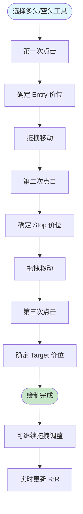
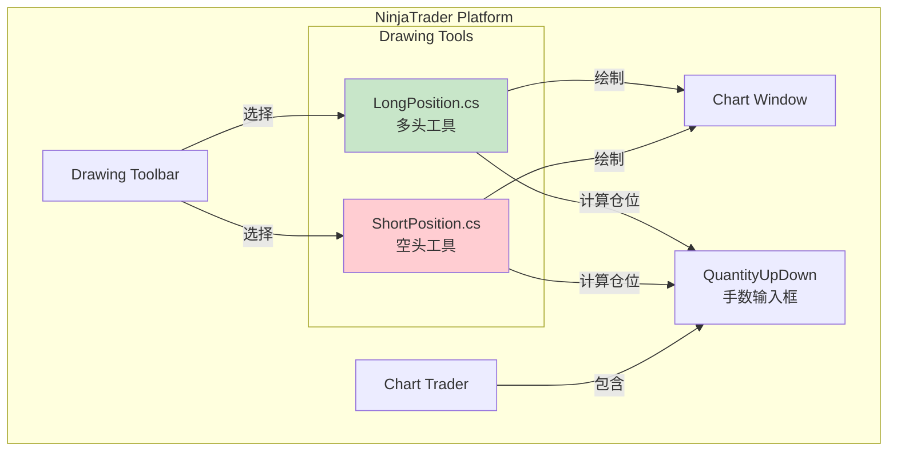
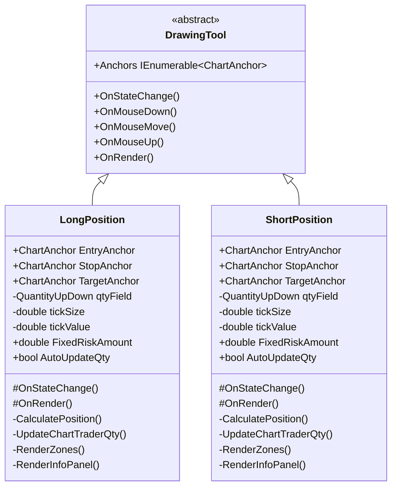
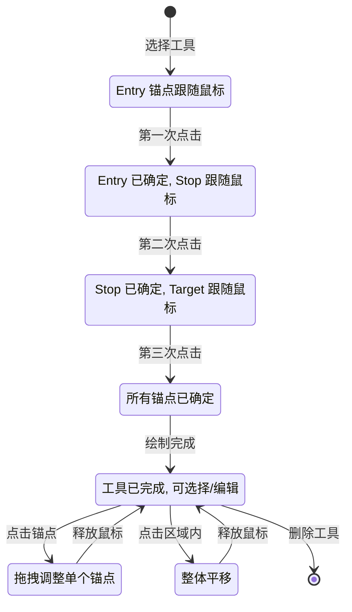
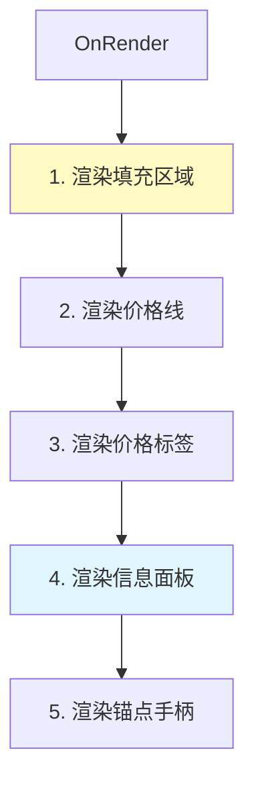
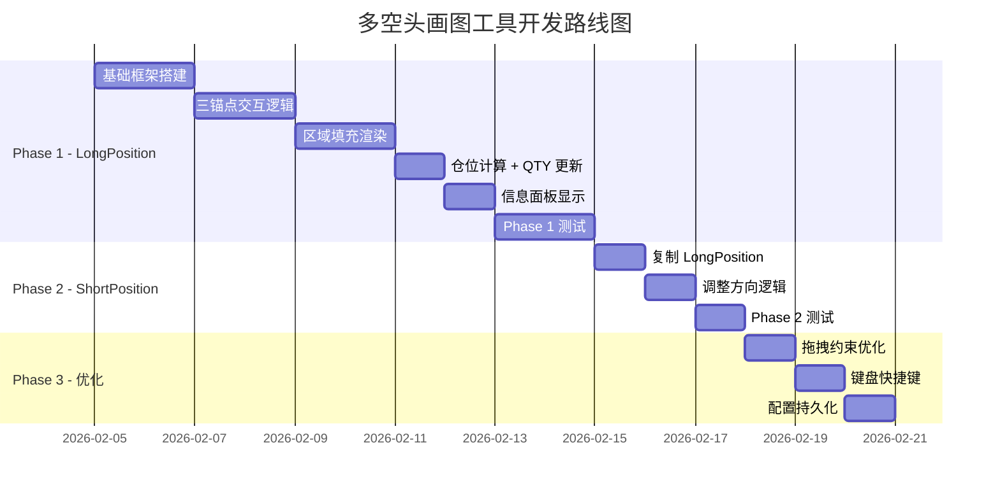
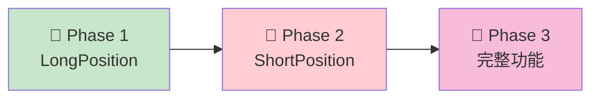
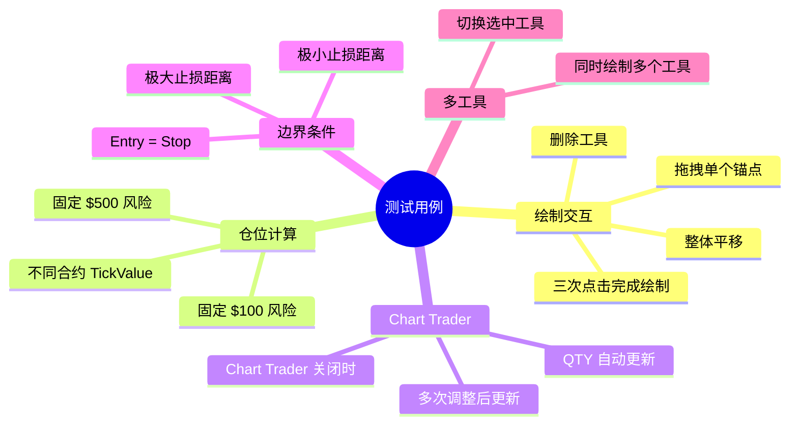

# NinjaTrader 8 多空头画图工具架构设计文档

> **版本**: 2.0
> **日期**: 2026-02-05
> **作者**: AI Assistant
> **状态**: 设计阶段

---

## 目录

1. [概述](#1-概述)
2. [TradingView 多空头工具分析](#2-tradingview-多空头工具分析)
3. [系统架构](#3-系统架构)
4. [核心算法](#4-核心算法)
5. [数据模型](#5-数据模型)
6. [交互流程](#6-交互流程)
7. [渲染设计](#7-渲染设计)
8. [API 参考](#8-api-参考)
9. [分阶段实现路线图](#9-分阶段实现路线图)
10. [测试策略](#10-测试策略)
11. [附录](#11-附录)

---

## 1. 概述

### 1.1 背景

TradingView 提供了便捷的「多头工具」和「空头工具」，允许交易者在图表上快速绘制入场、止损、目标价位，并可视化风险回报比。NinjaTrader 8 缺少类似的集成式 R:R 可视化画图工具。

本项目旨在开发两个 **DrawingTool（画图工具）**：

1. **LongPosition** - 多头工具
2. **ShortPosition** - 空头工具

与 TradingView 的区别是：**画完后能自动填充 Chart Trader 的手数**。

### 1.2 目标

**核心功能**
- 类似 TradingView 的三点绘制交互（Entry → Stop → Target）
- 入场区域、止损区域、目标区域可视化
- 实时计算并显示 R:R 比例
- 根据风险参数自动计算仓位大小
- **自动更新 Chart Trader 的 Quantity 输入框**

**两个独立工具**
| 工具 | 方向 | Entry | Stop | Target |
|------|------|-------|------|--------|
| LongPosition | 多头 | 中间 | Entry 下方 | Entry 上方 |
| ShortPosition | 空头 | 中间 | Entry 上方 | Entry 下方 |

### 1.3 技术栈

| 技术 | 版本/说明 |
|------|----------|
| .NET Framework | 4.8 |
| C# | 8.0+ |
| NinjaTrader SDK | NT8 Desktop SDK |
| 开发形态 | **DrawingTool（画图工具）** |
| 渲染 | SharpDX / Direct2D |

### 1.4 术语定义

| 术语 | 定义 |
|------|------|
| Entry | 入场价位（第一个锚点） |
| Stop | 止损价位（第二个锚点） |
| Target | 目标价位（第三个锚点） |
| R:R | Risk:Reward 风险回报比 |
| Tick | 最小价格变动单位 |
| TickSize | 每 Tick 的价格幅度 |
| TickValue | 每 Tick 的美元价值 |
| ChartAnchor | NinjaTrader 画图工具的锚点 |

### 1.5 与 TradingView 对比

| 功能 | TradingView | 本项目 |
|------|------------|--------|
| 多头工具 | ✅ | ✅ |
| 空头工具 | ✅ | ✅ |
| 三点绘制 | ✅ | ✅ |
| 区域填充 | ✅ | ✅ |
| R:R 显示 | ✅ | ✅ |
| 风险金额显示 | ✅ | ✅ |
| 仓位计算 | ✅ (需配置) | ✅ |
| **自动填充手数** | ❌ | ✅ |
| 拖拽调整 | ✅ | ✅ |

---

## 2. TradingView 多空头工具分析

### 2.1 操作流程



### 2.2 视觉元素

```
TradingView 多头工具示意图：

┌─────────────────────────────────────┐
│                                     │
│  ╔═══════════════════════════════╗  │  ← Target Zone (绿色填充)
│  ║   Target: 15480               ║  │
│  ║   +60 ticks  +$600  (2R)      ║  │
│  ╚═══════════════════════════════╝  │
│                                     │
│  ┌───────────────────────────────┐  │  ← Entry Line (蓝色)
│  │   Entry: 15420                │  │
│  │   Qty: 2 contracts            │  │
│  └───────────────────────────────┘  │
│                                     │
│  ╔═══════════════════════════════╗  │  ← Stop Zone (红色填充)
│  ║   Stop: 15390                 ║  │
│  ║   -30 ticks  -$300  (1R)      ║  │
│  ╚═══════════════════════════════╝  │
│                                     │
└─────────────────────────────────────┘

信息面板显示：
┌─────────────────┐
│ Risk:   $300    │
│ Reward: $600    │
│ R:R:    1:2.0   │
│ Qty:    2       │
└─────────────────┘
```

### 2.3 关键行为

| 行为 | 描述 |
|------|------|
| 第一次点击 | 设置 Entry 价位 |
| 第二次点击 | 设置 Stop 价位（多头在下方，空头在上方） |
| 第三次点击 | 设置 Target 价位（多头在上方，空头在下方） |
| 拖拽锚点 | 调整对应价位，实时重新计算 |
| 拖拽整体 | 平移整个工具 |
| 双击 | 打开属性面板 |

---

## 3. 系统架构

### 3.1 整体架构图



### 3.2 类结构



### 3.3 文件结构

```
DrawingTools/
├── LongPosition.cs      # 多头工具
└── ShortPosition.cs     # 空头工具
```

---

## 4. 核心算法

### 4.1 仓位计算公式

```csharp
// 从 Instrument 获取品种信息
double tickSize = AttachedTo.Instrument.MasterInstrument.TickSize;
double pointValue = AttachedTo.Instrument.MasterInstrument.PointValue;
double tickValue = pointValue * tickSize;

// 计算止损距离
double stopDistance = Math.Abs(EntryAnchor.Price - StopAnchor.Price);
double ticksToStop = stopDistance / tickSize;

// 计算仓位
double riskPerContract = ticksToStop * tickValue;
int qty = (int)Math.Floor(FixedRiskAmount / riskPerContract);
if (qty < 1) qty = 1;
```

### 4.2 R:R 比例计算

```csharp
double risk = Math.Abs(EntryAnchor.Price - StopAnchor.Price);
double reward = Math.Abs(TargetAnchor.Price - EntryAnchor.Price);
double riskReward = risk > 0 ? reward / risk : 0;
```

### 4.3 多头 vs 空头的区别

| 属性 | LongPosition | ShortPosition |
|------|-------------|---------------|
| Stop 位置 | Entry 下方 | Entry 上方 |
| Target 位置 | Entry 上方 | Entry 下方 |
| Stop Zone 颜色 | 红色（下方） | 红色（上方） |
| Target Zone 颜色 | 绿色（上方） | 绿色（下方） |
| 盈利方向 | 价格上涨 | 价格下跌 |

### 4.4 计算流程图

```mermaid
flowchart TD
    START([锚点位置变化]) --> GET_PRICES[获取 Entry/Stop/Target 价格]

    GET_PRICES --> CALC_RISK[计算风险距离<br/>risk = |Entry - Stop|]
    CALC_RISK --> CALC_REWARD[计算回报距离<br/>reward = |Target - Entry|]

    CALC_REWARD --> CALC_TICKS[计算 Tick 数<br/>ticks = risk / tickSize]
    CALC_TICKS --> CALC_DOLLARS[计算风险金额<br/>riskDollars = ticks × tickValue]

    CALC_DOLLARS --> CALC_QTY[计算仓位<br/>qty = FixedRisk / riskDollars]
    CALC_QTY --> CALC_RR[计算 R:R<br/>rr = reward / risk]

    CALC_RR --> UPDATE_QTY{AutoUpdateQty?}
    UPDATE_QTY -->|Yes| SET_QTY[更新 Chart Trader QTY]
    UPDATE_QTY -->|No| RENDER

    SET_QTY --> RENDER[重新渲染]
    RENDER --> END([完成])

    style CALC_QTY fill:#fff3e0
    style SET_QTY fill:#e1f5fe
```

---

## 5. 数据模型

### 5.1 锚点定义

```csharp
// 三个锚点
[Display(Order = 1)]
public ChartAnchor EntryAnchor { get; set; }   // 入场价

[Display(Order = 2)]
public ChartAnchor StopAnchor { get; set; }    // 止损价

[Display(Order = 3)]
public ChartAnchor TargetAnchor { get; set; }  // 目标价

public override IEnumerable<ChartAnchor> Anchors
{
    get { return new[] { EntryAnchor, StopAnchor, TargetAnchor }; }
}
```

### 5.2 用户参数

```csharp
#region User Parameters

// 风险设置
[NinjaScriptProperty]
[Display(Name = "Fixed Risk ($)", Description = "固定风险金额",
         GroupName = "1. Risk Settings", Order = 1)]
public double FixedRiskAmount { get; set; } = 200;

[NinjaScriptProperty]
[Display(Name = "Auto Update QTY", Description = "自动更新 Chart Trader 手数",
         GroupName = "1. Risk Settings", Order = 2)]
public bool AutoUpdateQty { get; set; } = true;

// 视觉设置
[Display(Name = "Entry Color", GroupName = "2. Colors", Order = 1)]
public Brush EntryColor { get; set; } = Brushes.DodgerBlue;

[Display(Name = "Stop Color", GroupName = "2. Colors", Order = 2)]
public Brush StopColor { get; set; } = Brushes.Red;

[Display(Name = "Target Color", GroupName = "2. Colors", Order = 3)]
public Brush TargetColor { get; set; } = Brushes.LimeGreen;

[Display(Name = "Zone Opacity", GroupName = "2. Colors", Order = 4)]
[Range(0, 100)]
public int ZoneOpacity { get; set; } = 20;

[Display(Name = "Line Width", GroupName = "3. Style", Order = 1)]
[Range(1, 5)]
public int LineWidth { get; set; } = 2;

[Display(Name = "Show Info Panel", GroupName = "3. Style", Order = 2)]
public bool ShowInfoPanel { get; set; } = true;

#endregion
```

### 5.3 计算结果（内部状态）

```csharp
#region Calculated Values (Internal)

private double entryPrice;
private double stopPrice;
private double targetPrice;

private double riskTicks;
private double rewardTicks;
private double riskDollars;
private double rewardDollars;
private double riskRewardRatio;
private int calculatedQty;

private double tickSize;
private double tickValue;
private QuantityUpDown qtyField;

#endregion
```

---

## 6. 交互流程

### 6.1 绘制状态机



### 6.2 OnMouseDown 逻辑

```csharp
public override void OnMouseDown(ChartControl chartControl, ChartPanel chartPanel,
                                  ChartScale chartScale, ChartAnchor dataPoint)
{
    switch (DrawingState)
    {
        case DrawingState.Building:
            if (EntryAnchor.IsEditing)
            {
                // 第一次点击 - 设置 Entry
                dataPoint.CopyDataValues(EntryAnchor);
                EntryAnchor.IsEditing = false;
                StopAnchor.IsEditing = true;

                // 初始化 Stop 和 Target 位置
                dataPoint.CopyDataValues(StopAnchor);
                dataPoint.CopyDataValues(TargetAnchor);
            }
            else if (StopAnchor.IsEditing)
            {
                // 第二次点击 - 设置 Stop
                dataPoint.CopyDataValues(StopAnchor);
                StopAnchor.IsEditing = false;
                TargetAnchor.IsEditing = true;
            }
            else if (TargetAnchor.IsEditing)
            {
                // 第三次点击 - 设置 Target，完成绘制
                dataPoint.CopyDataValues(TargetAnchor);
                TargetAnchor.IsEditing = false;
                DrawingState = DrawingState.Normal;
                IsSelected = false;

                // 绘制完成，更新 Chart Trader QTY
                if (AutoUpdateQty)
                    UpdateChartTraderQty();
            }
            break;

        case DrawingState.Normal:
            // 检测点击了哪个锚点或区域
            DetermineEditingAnchor(chartControl, chartPanel, chartScale, dataPoint);
            break;
    }
}
```

### 6.3 OnMouseMove 逻辑

```csharp
public override void OnMouseMove(ChartControl chartControl, ChartPanel chartPanel,
                                  ChartScale chartScale, ChartAnchor dataPoint)
{
    if (IsLocked && DrawingState != DrawingState.Building)
        return;

    switch (DrawingState)
    {
        case DrawingState.Building:
            if (StopAnchor.IsEditing)
            {
                // Stop 跟随鼠标（多头限制在 Entry 下方，空头限制在上方）
                AdjustStopAnchor(dataPoint);
            }
            else if (TargetAnchor.IsEditing)
            {
                // Target 跟随鼠标（多头限制在 Entry 上方，空头限制在下方）
                AdjustTargetAnchor(dataPoint);
            }
            break;

        case DrawingState.Editing:
            if (editingAnchor != null)
                dataPoint.CopyDataValues(editingAnchor);
            break;

        case DrawingState.Moving:
            foreach (ChartAnchor anchor in Anchors)
                anchor.MoveAnchor(InitialMouseDownAnchor, dataPoint,
                                  chartControl, chartPanel, chartScale, this);
            break;
    }

    // 每次移动都重新计算
    RecalculateValues();
}
```

---

## 7. 渲染设计

### 7.1 渲染层次



### 7.2 多头工具渲染示意

```
┌────────────────────────────────────────────────────────────┐
│                                                            │
│  ┌──────────────────────────────────────────────────────┐  │
│  │▓▓▓▓▓▓▓▓▓▓▓▓▓▓▓▓▓▓▓▓▓▓▓▓▓▓▓▓▓▓▓▓▓▓▓▓▓▓▓▓▓▓▓▓▓▓▓▓▓▓▓▓│  │  ← Target Zone
│  │▓▓▓▓▓▓▓▓▓▓▓▓▓▓▓▓▓▓▓▓▓▓▓▓▓▓▓▓▓▓▓▓▓▓▓▓▓▓▓▓▓▓▓▓▓▓▓▓▓▓▓▓│  │    (绿色半透明)
│  ├──────────────────────────────────────────────────────┤  │  ← Target Line (绿)
│  │  Target: 15480.00  |  +60 ticks  |  +$600  |  2.0R  │  │
│  └──────────────────────────────────────────────────────┘  │
│                                                            │
│  ════════════════════════════════════════════════════════  │  ← Entry Line (蓝)
│  │  Entry: 15420.00   |  Qty: 2 contracts              │  │
│                                                            │
│  ┌──────────────────────────────────────────────────────┐  │
│  │░░░░░░░░░░░░░░░░░░░░░░░░░░░░░░░░░░░░░░░░░░░░░░░░░░░░░░│  │  ← Stop Zone
│  │░░░░░░░░░░░░░░░░░░░░░░░░░░░░░░░░░░░░░░░░░░░░░░░░░░░░░░│  │    (红色半透明)
│  ├──────────────────────────────────────────────────────┤  │  ← Stop Line (红)
│  │  Stop: 15390.00    |  -30 ticks  |  -$300  |  1R    │  │
│  └──────────────────────────────────────────────────────┘  │
│                                                            │
│  ┌─────────────────┐                                       │
│  │ Risk:   $300    │  ← Info Panel (可选)                  │
│  │ Reward: $600    │                                       │
│  │ R:R:    1:2.0   │                                       │
│  │ Qty:    2       │                                       │
│  └─────────────────┘                                       │
│                                                            │
└────────────────────────────────────────────────────────────┘
```

### 7.3 渲染代码结构

```csharp
public override void OnRender(ChartControl chartControl, ChartScale chartScale)
{
    // 0. 初始化
    RenderTarget.AntialiasMode = SharpDX.Direct2D1.AntialiasMode.PerPrimitive;
    ChartPanel chartPanel = chartControl.ChartPanels[chartScale.PanelIndex];

    // 获取锚点位置
    Point entryPoint = EntryAnchor.GetPoint(chartControl, chartPanel, chartScale);
    Point stopPoint = StopAnchor.GetPoint(chartControl, chartPanel, chartScale);
    Point targetPoint = TargetAnchor.GetPoint(chartControl, chartPanel, chartScale);

    // 计算区域边界
    float minX = (float)Math.Min(Math.Min(entryPoint.X, stopPoint.X), targetPoint.X);
    float maxX = (float)Math.Max(Math.Max(entryPoint.X, stopPoint.X), targetPoint.X);

    // 1. 渲染填充区域
    RenderZones(chartScale, minX, maxX, entryPoint, stopPoint, targetPoint);

    // 2. 渲染价格线
    RenderPriceLines(minX, maxX, entryPoint, stopPoint, targetPoint);

    // 3. 渲染价格标签
    RenderPriceLabels(chartControl, chartScale, maxX, entryPoint, stopPoint, targetPoint);

    // 4. 渲染信息面板
    if (ShowInfoPanel)
        RenderInfoPanel(chartControl, minX);

    // 5. 更新 Chart Trader QTY
    if (AutoUpdateQty && DrawingState == DrawingState.Normal)
        UpdateChartTraderQty();
}
```

### 7.4 Zone 填充渲染

```csharp
private void RenderZones(ChartScale chartScale, float minX, float maxX,
                          Point entryPoint, Point stopPoint, Point targetPoint)
{
    float entryY = (float)entryPoint.Y;
    float stopY = (float)stopPoint.Y;
    float targetY = (float)targetPoint.Y;

    // Stop Zone (红色)
    var stopZoneBrush = CreateSemiTransparentBrush(StopColor, ZoneOpacity);
    var stopRect = new SharpDX.RectangleF(
        minX,
        Math.Min(entryY, stopY),
        maxX - minX,
        Math.Abs(entryY - stopY));
    RenderTarget.FillRectangle(stopRect, stopZoneBrush);
    stopZoneBrush.Dispose();

    // Target Zone (绿色)
    var targetZoneBrush = CreateSemiTransparentBrush(TargetColor, ZoneOpacity);
    var targetRect = new SharpDX.RectangleF(
        minX,
        Math.Min(entryY, targetY),
        maxX - minX,
        Math.Abs(entryY - targetY));
    RenderTarget.FillRectangle(targetRect, targetZoneBrush);
    targetZoneBrush.Dispose();
}
```

---

## 8. API 参考

### 8.1 获取 Chart Trader QTY 控件

```csharp
private void FindChartTraderQtyField()
{
    if (ChartControl == null)
        return;

    ChartControl.Dispatcher.InvokeAsync((Action)(() =>
    {
        try
        {
            var window = Window.GetWindow(ChartControl.Parent);
            if (window != null)
            {
                qtyField = window.FindFirst("ChartTraderControlQuantitySelector")
                           as QuantityUpDown;
            }
        }
        catch (Exception ex)
        {
            Log("Failed to find Chart Trader QTY field: " + ex.Message,
                LogLevel.Error);
        }
    }));
}
```

### 8.2 更新 Chart Trader 手数

```csharp
private void UpdateChartTraderQty()
{
    if (qtyField == null || !AutoUpdateQty)
        return;

    if (calculatedQty != lastUpdatedQty)
    {
        ChartControl.Dispatcher.InvokeAsync((Action)(() =>
        {
            try
            {
                qtyField.Value = calculatedQty;
                lastUpdatedQty = calculatedQty;
            }
            catch (Exception ex)
            {
                Log("Failed to update QTY: " + ex.Message, LogLevel.Error);
            }
        }));
    }
}
```

### 8.3 获取品种信息

```csharp
private void InitializeInstrumentInfo()
{
    if (AttachedTo?.Instrument?.MasterInstrument == null)
        return;

    tickSize = AttachedTo.Instrument.MasterInstrument.TickSize;
    double pointValue = AttachedTo.Instrument.MasterInstrument.PointValue;
    tickValue = pointValue * tickSize;
}
```

### 8.4 创建半透明画刷

```csharp
private SharpDX.Direct2D1.Brush CreateSemiTransparentBrush(Brush wpfBrush, int opacity)
{
    var color = ((SolidColorBrush)wpfBrush).Color;
    var dxColor = new SharpDX.Color(color.R, color.G, color.B, (byte)(255 * opacity / 100));
    return new SharpDX.Direct2D1.SolidColorBrush(RenderTarget, dxColor);
}
```

---

## 9. 分阶段实现路线图

### 9.1 整体规划



### 9.2 Phase 1: LongPosition (多头工具)

**目标**: 实现完整的多头画图工具

| 任务 | 描述 | 优先级 |
|------|------|--------|
| P1.1 基础框架 | DrawingTool 骨架、三个锚点 | 🔴 High |
| P1.2 交互逻辑 | 三次点击绘制、拖拽调整 | 🔴 High |
| P1.3 区域渲染 | Stop/Target Zone 填充 | 🔴 High |
| P1.4 仓位计算 | 计算 + 更新 Chart Trader QTY | 🔴 High |
| P1.5 信息面板 | R:R、风险金额显示 | 🟡 Medium |

**交付物**:
- LongPosition.cs 完整实现
- 可在 NinjaTrader 图表工具栏使用

### 9.3 Phase 2: ShortPosition (空头工具)

**目标**: 基于 LongPosition 实现空头工具

| 任务 | 描述 | 优先级 |
|------|------|--------|
| P2.1 复制框架 | 从 LongPosition 复制代码 | 🔴 High |
| P2.2 方向调整 | Stop 在上方，Target 在下方 | 🔴 High |

**交付物**:
- ShortPosition.cs 完整实现

### 9.4 Phase 3: 优化

**目标**: 改善用户体验

| 任务 | 描述 | 优先级 |
|------|------|--------|
| P3.1 拖拽约束 | Stop 不能越过 Entry 等 | 🟡 Medium |
| P3.2 快捷键 | Escape 取消绘制等 | 🟢 Low |
| P3.3 持久化 | 保存用户配置 | 🟢 Low |

### 9.5 里程碑



---

## 10. 测试策略

### 10.1 测试环境

| 环境 | 说明 |
|------|------|
| 账户 | Sim101 (模拟账户) |
| 合约 | NQ, ES, MNQ, MES |
| 市场状态 | 实时市场数据 |

### 10.2 测试用例



### 10.3 验证步骤

1. **编译验证**: 确保无编译错误
2. **工具栏验证**: 工具出现在 Drawing Tools 列表
3. **绘制验证**: 三次点击完成绘制
4. **渲染验证**: Zone 填充、价格线正确显示
5. **计算验证**: R:R、仓位计算正确
6. **QTY 验证**: Chart Trader 手数正确更新
7. **多合约验证**: 在不同合约上测试

---

## 11. 附录

### 11.1 DrawingTool 开发要点

#### 11.1.1 锚点初始化

```csharp
protected override void OnStateChange()
{
    if (State == State.SetDefaults)
    {
        Name = "LongPosition";
        DrawingState = DrawingState.Building;

        // 初始化锚点
        EntryAnchor = new ChartAnchor { IsEditing = true, DrawingTool = this };
        StopAnchor = new ChartAnchor { IsEditing = false, DrawingTool = this };
        TargetAnchor = new ChartAnchor { IsEditing = false, DrawingTool = this };
    }
}
```

#### 11.1.2 必须实现的方法

```csharp
public override IEnumerable<ChartAnchor> Anchors { get; }
public override object Icon { get; }
public override bool SupportsAlerts { get; }

public override Cursor GetCursor(...);
public override Point[] GetSelectionPoints(...);
public override bool IsVisibleOnChart(...);
public override void OnCalculateMinMax();
public override void OnMouseDown(...);
public override void OnMouseMove(...);
public override void OnMouseUp(...);
public override void OnRender(...);
```

### 11.2 现有 DrawingTool 参考

项目中已有的画图工具可作为参考：

- `MeasureMove.cs` - 两锚点 + 多条水平线
- `FiftyPercent.cs` - 两锚点 + 单条水平线
- `RangeZone.cs` - 区域填充示例

### 11.3 NinjaTrader 开发注意事项

> [!IMPORTANT]
> DrawingTool 与 Indicator 的关键区别

| 特性 | DrawingTool | Indicator |
|------|-------------|-----------|
| 加载方式 | 工具栏选择 | 添加到图表 |
| 生命周期 | 用户绘制时创建 | 图表加载时创建 |
| 品种信息 | `AttachedTo.Instrument` | `Instrument` |
| 渲染 | `OnRender` (SharpDX) | `OnRender` 或 Plot |
| 交互 | OnMouseDown/Move/Up | 无 |

### 11.4 参考资料

- [NinjaTrader 8 Drawing Tool Development](https://developer.ninjatrader.com/docs/desktop/drawing_tool)
- [ChartAnchor Class](https://developer.ninjatrader.com/docs/desktop/chartanchor)
- [SharpDX Direct2D Rendering](https://developer.ninjatrader.com/docs/desktop/rendering)
- [szabonorbert/ninjatrader-fixrisk](https://github.com/szabonorbert/ninjatrader-fixrisk) - Chart Trader QTY 更新参考
- [TradingView Long/Short Position Tool](https://www.tradingview.com/support/solutions/43000516840-long-position-tool-short-position-tool/)

---

*文档结束*
